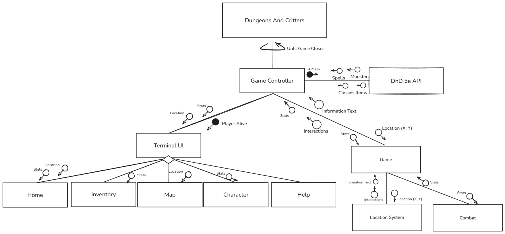
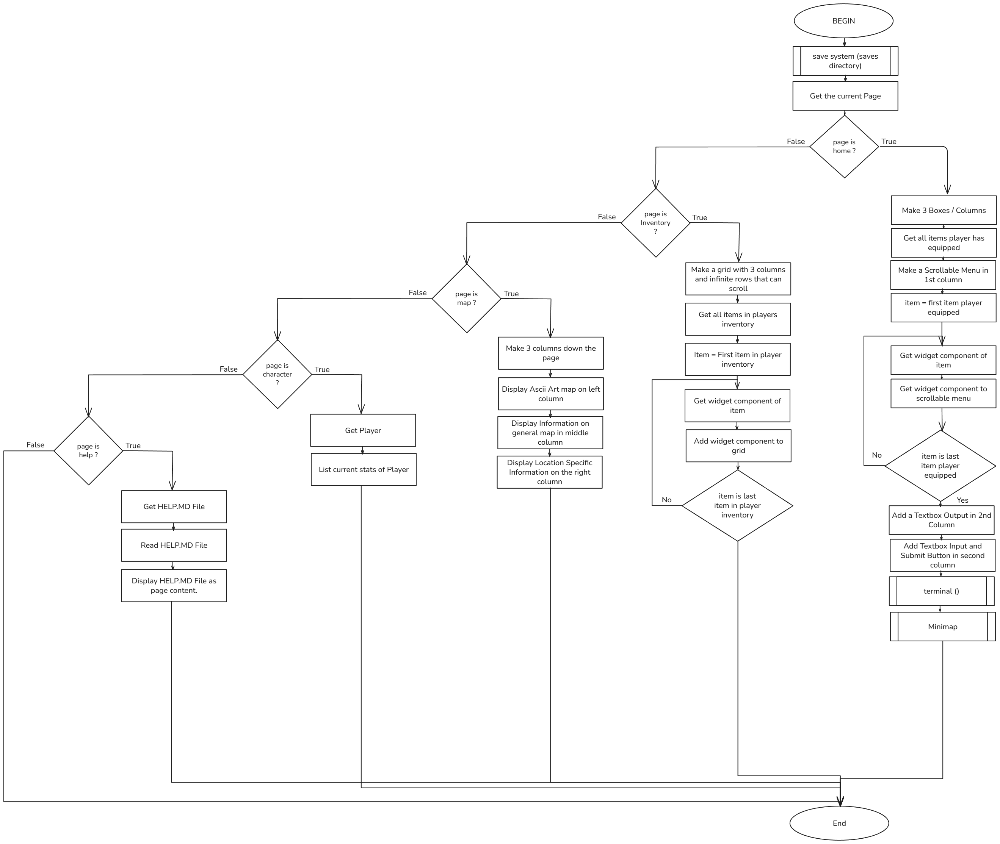
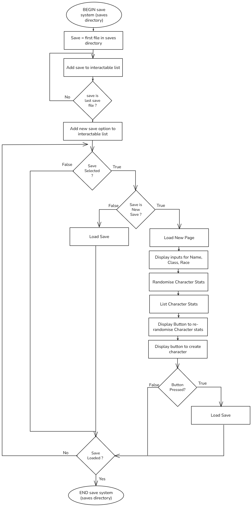
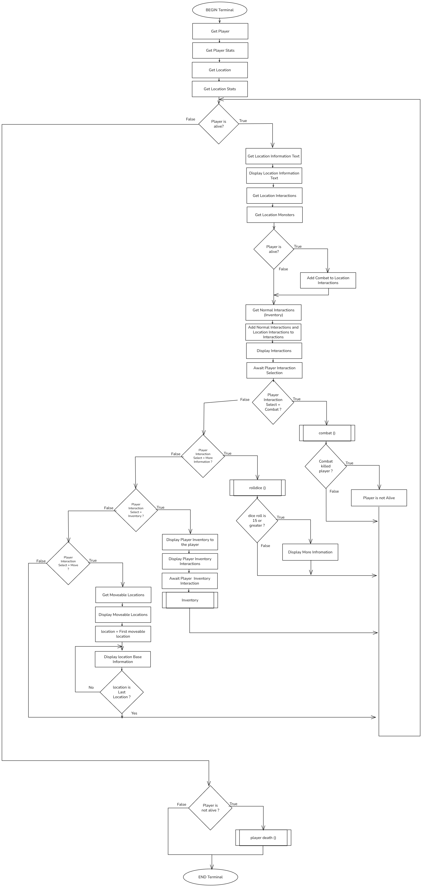
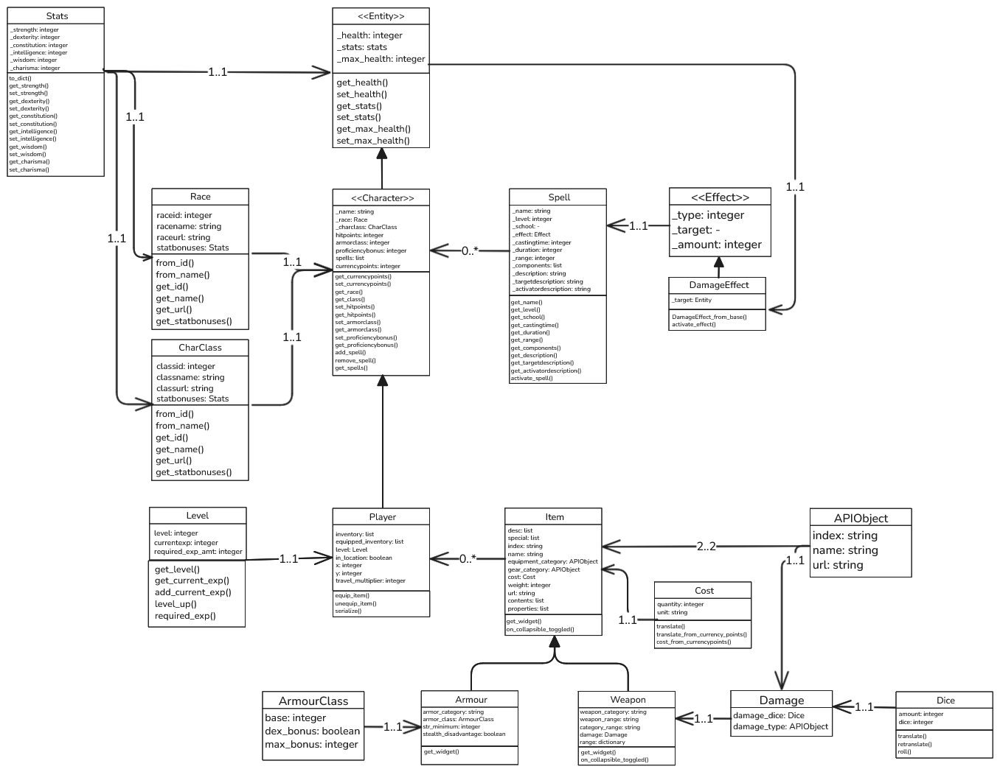

# Jamie Hanson - Software Engineering - Task 2 2025 - Due 20/5/2025
### By Jamie Hanson

# Sprint 1
## Requirements Definition
### Functional Requirements
* A user interface featuring easy to read menus that display information for the user.
* An inventory system allowing the user to see their items
* A map system allowing the user to see the world
* A Character Creator allowing the system to make their own character with its own stats (Functional DnD stats)
* Inputs that allow for text to be typed, inputs to be received from keyboard presses outside of text boxes, and mouse clicks.
* An easy to read heads up display (HUD) or UI displaying the players health and basic stats.
* A terminal like menu for the text-based portion of the game.
* Display errors to the user to allow for user-based errors to be fixed in runtime.
### Non-Functional Requirements
* The system needs to be quick, launching within 3 seconds.
* The system needs to reliably handle crashes, giving the user enough information to report it or fix it themselves.
* The system needs to reliably handle user errors, producing useable data from any scenario or alternatively denying the submission of the data until the format is correct.
* The system needs to be easy to navigate via the Keyboard and Mouse, (Mainly the keyboard)
* The system should have a tab or seperate menu for help, which will provide documentation on the core functionallity of the system and where to get more help about each part of the system.
* The system needs to reliably get and convert save data aswell as user inputs. Save corruption and errors in loading should be a worst case scenario and happen few and far between, if at all.

## Determining Specifications
### Functional Specifications
* The user needs to be able to easily access multiple saves for different characters that are clearly labelled and independant.
* The user needs to be able to easily navigate between the main UI's.
* The user needs to be able to quickly and easily control there characters inventory and stats.
* The user needs to be able to easily access a help page that will explain the systems more complex implementations
* The system needs to accept UI related inputs like tab switching through the keyboard and mouse aswell as text based inputs that cut off control the the UI while entered.
* Text inputs should accept all basic unicode characters.
* The system needs to output the players location, health, stats, and other basic details
* The system needs to output the players actions and details within the "Terminal" within the program.
* The program needs to be able to access online databases (DnD 5e's API) to get stats for monsters and items etc...
* The user will interact with the system through A TUI (Terminal User Interface) mixed with its own actual CLI (Command Line Interface) within the TUI. The CLI within the TUI will be used for player actions.
* Any invalid inputs need to be either rejected, or clearly output incorrect answers that allows the user to correct their mistake with minimal reprecussions.
* The system needs to be able to provide a basic crash log in the form of a .log file within the logs folder. 

### Non-Functional Specifications
* The system should be lightning fast, running everything visually within seconds and the content taking a little bit longer than that.
* Basic actions should have response times in less than a second. With bigger actions allowing for longer wait times.
* The program will need to remain efficient through efficient use of hard coding details and caching.
* The TUI will use mainly high contrasting colours avoiding white text on white backgrounds etc...
* The TUI should be nearly completely navigatable through just the keyboard using TAB and over varients.
* Data corruption needs to be minimal and not occur throughout any stage of testing (Unless tests are run mid-sprint not post-sprint, then data corruption can be ignored).
* Invalid data from online sources like the DnD database could cause a lack of reliability, so the program should minimise the effect of invalid data through a placeholder method (I.E. If a mob that doesn't exist is called, it could replace it with a basic humanoid zombie or something similar)

### Use Case
**Actor:** User (Professional or Amateur Gamer)

**Preconditions:** Internet access; API with DnD data is available. Python installed.

**Main Flow:**
 1. Load / Create a save.
 2. Display Save Data -- Character Stats, Inventory, Location, etc... --; System confirms data and displays it to the user.
 3. Use Terminal Actions -- Move the player, Equip Items, Attack, Etc... --; The system displays the actions informational text and updates the stats and save.
 4. Finalise Save; The system adds content to the save. 
 5. Beat the game, -- User completes the win condition of the game --; The system keeps or deletes the save, and marks the game as complete. Removing most of the playable content.
 

**Postconditions:** Save data is retrieved and stored successfully.


## Design
### Story Board

### Data Flow Diagram - Level 0 (Context) and Level 1
**Level 0** \


**Level 1** \


### Gantt Chart


## Build and Test
```py
import os
from pathlib import Path
from textual.app import App, ComposeResult
from textual.widgets import Header, Footer, TabbedContent, Static, TabPane, MarkdownViewer, Collapsible, Button, Input, Label, Log, ListItem, ListView, Select, Rule
from textual.containers import Grid, VerticalScroll, Vertical, Container, Horizontal, Center
from textual.reactive import reactive
from textual.events import Event
import json
import random


# Basic Item Class for testing, Will eventually have way more stats.
class Item:
    def __init__(self, name: str, description: str):
        self.name = name
        self.description = description

    def get_widget(self) -> Collapsible:
        return Collapsible(Static(self.description), title=self.name, collapsed=True)


# Example items in the inventory, this will later be replaced with items filled by Dnd 5E API
items = [
    Item("Sword of Testing", "A legendary test blade."),
    Item("Potion of Bugs", "Causes strange behavior."),
    Item("Scroll of Logs", "Reveals hidden logs."),
    Item("Amulet of Power", "Grants strength."),
    Item("Shield of Invincibility", "Protects from damage."),
    Item("Ring of Wisdom", "Increases intelligence.")
]


savefilepath = ""
savefile = None

class SaveFile(): # This is a basic non-saving save file system, It does load but doesn't save.
    def __init__(self, filepath):
        self.filepath = filepath
        self.data = {}
        self.load()

    def load(self): # Try's to read the file but if it fails returns null.
        try:
            with open(self.filepath, 'r') as f:
                self.data = json.load(f)
        except FileNotFoundError:
            self.data = {}


    def save(self): # Unused but this would theoretically save the file (Unused because nothing is added to the save data yet)
        with open(self.filepath, 'w') as f:
            json.dump(self.data, f, indent=4)

    def get(self, key, default=None):
        return self.data.get(key, default)

    def set(self, key, value):
        self.data[key] = value

    def delete(self, key):
         if key in self.data:
            del self.data[key]

class NewSaveSubmit(Horizontal): # This is the button submit and the input for save files. This allows us to send the player to the character menu
    def __init__(self):
        super().__init__(classes="load_screen-submit")
        self.savename = ""

    def on_input_changed(self, event: Input.Changed):
        self.savename = ''.join(e for e in event.value if e.isalnum())

    def on_button_pressed(self, event: Button.Pressed):
        global savefilepath, savefile
        if event.button.id == "submit_button": # Makes sure its the correct button
            savefiles = []

            for entry in os.scandir("saves"):
                if entry.is_file() and Path(entry).suffix == ".json":
                    savefiles.append(entry.path)


            if len(savefiles) != 0 and "saves/" + self.savename + ".json" in savefiles:
                return

            savefilepath = "saves/" + self.savename + ".json"

            savefile = SaveFile(savefilepath)

            self.app.create_game()

    def compose(self): # This is just setting up what is inside of the Horizontal frame
        yield Input(placeholder="Save Name", classes="load_screen-input")
        yield Button(label="Submit", id="submit_button", classes="load_screen-button")

class LoadScreen(Container): # This lists of every save in a ListView and then adds an extra iteration for the new save.
    def __init__(self):
        super().__init__()
        directory = "saves"
        self.savefiles = []

        for entry in os.scandir(directory):
            if entry.is_file() and Path(entry).suffix == ".json":
                self.savefiles.append(entry.path)

    def on_list_view_selected(self, event: ListView.Selected):
        global savefilepath, savefile
        if event.item.query_one(Label).renderable == "New Save":
            self.mount(NewSaveSubmit())
        else:
            savefilepath = event.item.query_one(Label).renderable
            savefile = SaveFile(savefilepath)
            self.app.load_game()

    def compose(self):
        yield Static("Select Save", id="tab_title")
        with ListView(id="save_item"):
            if len(self.savefiles) != 0:
                for save in self.savefiles:
                    yield ListItem(Label(save.lstrip("saves/").rstrip(".json")))
            yield ListItem(Label("New Save"))

class MainPages(Container): # This is the main container for the app that sets up all the pages
    def __init__(self):
        super().__init__()

    def compose(self) -> ComposeResult:
        global items

        with TabbedContent(): # This allows us to have tabs to break up the program into various windows
            yield HomePage("Home (h)")

            yield MapPage("Map (m)")
            yield InventoryPage("Inventory (i)")
            yield CharacterPage("Character (c)")

            with TabPane("Help (?)", id="tab_help"):
                yield MarkdownViewer(Path("help.md").read_text(), show_table_of_contents=True)

class HomePage(TabPane): # This page is dedicated to displaying inputs
    def __init__(self, name):
        super().__init__(name, id="tab_home")

    def compose(self):
        yield Static ("Home Page", id="tab_title")
        with Horizontal(classes="home_tab-main"):
            with Vertical(classes="home_tab-columns"):
                # Everything to do with the first column here
                yield Static("Statistics", classes="generic_tab-title")
                yield Static("Hit Points: 10", classes="home_tab-statistics-stat")
                yield Static("Armor Class: 15", classes="home_tab-statistics-stat")
                yield Static("Proficiency Bonus: 2", classes="home_tab-statistics-stat")
                yield Static("")
                yield Static("Equipped Items: ", classes="home_tab-statistics-subheading")
                with VerticalScroll(classes="home_tab-statistics-verticalscroll"):
                    for i in items: # Replace this with equipped items eventualls
                        yield i.get_widget()
            with Vertical(classes="home_tab-interactions-column"):
                with VerticalScroll(classes="home_tab-interactions-console"):
                    yield Static("Welcome to the world of Dungeons and Crawlers", classes="home_tab-interactions-console-line")
                yield Rule()
                with Center():
                    with Horizontal(classes="home_tab-command_input"):
                        yield Input(placeholder="Enter a command: ", id="home_tab-interactions-command_input", classes="home_tab-interactions-command_input-input")
                        yield Button("", id="home_tab-interactions-command_button", classes="home_tab-interactions-command_input-button")
            with Vertical(classes="home_tab-columns"):
                yield Static("Minimap", classes="generic_tab-title")

class MapPage(TabPane): # Self explanatory, just text and columns aswell as an ascii art of what the map might look like.
    def __init__(self, name):
        super().__init__(name, id="tab_map")

    def compose(self):
        yield Static("Map Page", id="tab_title")
        ascii_art = r"""

                                  ~~~~~~
                        /\       ~~~~~~~     OAKENSHORE
                   /\  /__\       ~~~        (City of Oaks)
                 /\   /    \         ~~~~
              /\ /__\        /\       ~~~~~~~
             /__\            /__\     ~~~~~~~
            /\   VALLEY OF THE KINGS         /\\
           /__\          /\                 /__\\
                 /\     /__\              FOOTHILLS
                /__\                    (Small Town)
                   RIVER OF DRAGONS   ~~~~~~~~~~
~~~~~~~~~~~~~~~~~~~                        ~~~~~~~~
~~~~~~~~~~~~~~         MOUNT ASHBRIAR     ~~~~~~~~
    ~~~~~~~~~~~~~~          /\            ~~~~~~~~~~~
~~~~~~~~~~                 /__\                 ~~~~~~~
~                     /\                       HIGHLANDS
~    WINDWOOD     ~~~/  \~~~           VALORSTED (Capital)
~   (Dense Forest)~~~    ~~~~          ~~~~~~~~~~~~~~~
~~~~~    ~~~~~~~~~~~    ~~~~~~~~       ~~~~~~~~~~~~
~~~~~~~~~~~~~~~~~~~~~~~       ~~~~~~~~~~        ~~~~
                     SHORECLIFFS         ~~~~~~~~~
                           (Coastal City)                   """
        # Create a Static widget with the ASCII art
        with Horizontal():
            asciiartmap = Static(ascii_art, classes="map_tab-ascii")
            asciiartmap.border_title="Elednor Isles"
            yield asciiartmap
            with Vertical(classes = "map_tab-column"):
                yield Static("Some info over here or smth", classes="map_tab-sub_info")
                yield Static("* ELednor Isles 15 anno", classes="map_tab-sub_info")
                yield Static("* Other basic info", classes="map_tab-sub_info")

class InventoryPage(TabPane): # This just loops through all the items that are in the items list and puts them into a grid for the user, allowing them to be dropped down with the .get_widget from  the Item() class
    def __init__(self, name):
        super().__init__(name, id="tab_inventory")

    def compose(self):
        yield Static("Inventory Page", id="tab_title")
        with Grid(id="inventory_grid"):
            for column in range(3):
                with VerticalScroll(id=f"inventory_column_{column}"):
                    for i in range(column, len(items), 3):
                        yield items[i].get_widget()

class CharacterPage(TabPane): # This just displays all the character ifnormation for the player, like stats. Just text pretty much.
    def __init__(self, name):
        super().__init__(name, id="tab_character")

    def compose(self):
        yield Static("Character Page", id="tab_title")
        with Horizontal():
            with Vertical():
                yield Static("Stats", classes="character_tab-column_title")

                yield Static("")

                yield Static("Name: Bobathy", id="label_name", classes="character_tab-label")
                yield Static("Race: Human", id="label_human", classes="character_tab-label")
                yield Static("Class: Fighter", id="label_class", classes="character_tab-label")

                yield Static("")

                yield Static("Level: 1", id="label_level", classes="character_tab-stat")

                yield Static("")

                ability_scores = CharacterCreator().reroll_stats() # sets stats to be random as saving isn't currently used

                for stat in ability_scores:
                    yield Static(f"{stat.capitalize()}: {ability_scores[stat]}", id=f"{stat}_stat", classes="character_tab-stat")

                yield Static("")

                yield Static("Hit Points: 10")
                yield Static("Armor Class: 15")
                yield Static("Proficiency Bonus: 2")
            with Vertical():
                yield Static("Spells", classes="character_tab-column_title")

                yield Static("")

                yield Static("* You have no spells")
            with Vertical():
                yield Static("Others", classes="character_tab-column_title")

                yield Static("")

                yield Static("* Nothing to See Here")

class CharacterCreator(Container): # Creates the character
    def __init__(self):
        super().__init__(id="character_creator-main")

    def compose(self):
        # Character Name Input
        ability_scores = self.reroll_stats()

        yield Static("Character Creator", classes="generic_tab-title")

        with Center():
            yield Input(placeholder="Enter character name", id="input_name", classes="character_creator-input")

        # Race Selection
        races = [("Human", 1), ("Orc", 2)] # this style of list allows us to set things into the dropdown and give them a weighting.
        with Center():
            yield Select(races, prompt="Select Race", id = "select_race", classes="character_creator-select") # Automatically lays the list out in a drolpdown list.

        # Class Selection
        char_classes = [("Barbarian", 1), ("Fighter", 2)]
        with Center():
            yield Select(char_classes, prompt="Select Class", id = "select_class", classes="character_creator-select")

        yield Static("")

        # Level Selection (you can later expand this to be dynamic)
        yield Static("Level: 1", id="level", classes="character_creator-stat")

        yield Static("")

        # Ability Scores Display and Roll Button
        for stat in ability_scores:
            yield Static(f"{stat.capitalize()}: {ability_scores[stat]}", id=f"{stat}_stat", classes="character_creator-stat")

        yield Static("")

        with Center():
            yield Button(label="Roll Ability Scores", id="roll_button", classes="character_creator-roll_button")

        yield Static("")

        # Hit Points Input
        yield Static("Hit Points: 10", id="label_hp", classes="character_creator-stat")

        # Armor Class Input
        yield Static("Armor Class: 15", id="label_ac", classes="character_creator-stat")

        # Proficiency Bonus Input
        yield Static("Proficiency Bonus: 2", id="label_pb", classes="character_creator-stat")

        yield Static("")

        # Final confirmation or save button
        with Center():
            yield Button(label="Create Character", id="save_button", classes="character_creator-save_button")

    def on_input_changed(self, event: Input.Changed):
        """Handle all input changes in one function"""
        if event.input.id == "input_name":
            name = event.value
        elif event.input.id == "input_race":
            race = event.value
        elif event.input.id == "input_class":
            char_class = event.value

    def on_button_pressed(self, event: Button.Pressed):
        if (event.button.id == "save_button"):
            # Save Here
            self.app.load_made_game()
        elif (event.button.id == "roll_button"):
            ability_scores = self.reroll_stats()
            for key in ability_scores:
                self.query_one(f"#{key}_stat", Static).update(f"{key.capitalize()}: " + str(ability_scores[key]))

    def reroll_stats(self): # Randomises stats
        ability_scores = {}
        ability_scores["strength"] = self.roll_stat()
        ability_scores["dexterity"] = self.roll_stat()
        ability_scores["constitution"] = self.roll_stat()
        ability_scores["intelligence"] = self.roll_stat()
        ability_scores["wisdom"] = self.roll_stat()
        ability_scores["charisma"] = self.roll_stat()
        return ability_scores


    def roll_stat(self) -> int: # Emulates rolling 4d6 and getting rid of the lowest dice roll.
        dice = [random.randint(1, 6) for _ in range(4)]
        dice.remove(min(dice))  # Remove the lowest roll
        return sum(dice)  # Sum the remaining 3 dice


class MyApp(App): # This is the main app container that composes everything
    TITLE = "Dungeons And Critters"
    SUB_TITLE = "Version 1.0 (WIP)"
    CSS_PATH = "textual-main.tcss"
    BINDINGS = [("h", "tab_home", "Home"), ("m", "tab_map", "Map"), ("i", "tab_inventory", "Inventory"), ("c", "tab_character", "Character"), ("?", "tab_help", "Help")]

    def compose(self) -> ComposeResult: # Displays load screen before the main pages
        yield Header()
        yield LoadScreen()  # Display save/load screen first
        # yield MainPages()

    def load_game(self) -> None: 
        self.query_one(LoadScreen).remove()  # Remove the save/load screen
        self.mount(MainPages())  # Show the main app after loading

    def load_made_game(self) -> None: # The game is made so it gets rid of the character creator.
        self.query_one(CharacterCreator).remove()
        self.mount(MainPages())

    def create_game(self) -> None: # This loads the character creator
        self.query_one(LoadScreen).remove()
        self.mount(CharacterCreator())

    # This sets up all of the tabs
    def action_tab_home(self) -> None:
        self.query_one(TabbedContent).active = "tab_home"

    def action_tab_map(self) -> None:
        self.query_one(TabbedContent).active = "tab_map"

    def action_tab_inventory(self) -> None:
        self.query_one(TabbedContent).active = "tab_inventory"

    def action_tab_character(self) -> None:
        self.query_one(TabbedContent).active = "tab_character"

    def action_tab_help(self) -> None:
        self.query_one(TabbedContent).active = "tab_help"


if __name__ == "__main__":
    app = MyApp()
    app.run()
```
## Review
**Question 1 )**
Dungeons and Critters has various functional and non-functional requirements all defined in this sprint. Currently the game fulfils the functional requirements section of the outline to an exceptional level, having fulfilled all functional requirements but 2 to a base level. The two that currently aren't displayed will be implemented in the following 2 sprints as the both require programatic functionality rather then the simplistic TUI functionality that this sprint focused on. In short I think that for the First Sprint, the project is currently fulfilling the functional requirements extremely effectively.
Dungeons and Critters non-functional requirements are a little harder to meet at this stage, as they involve specifications about systems not yet implemented, however for what this sprint set out to achieve, it did it effectively and reliably. Firstly for me, the game launches before I could snap my fingers, and the UI is completely navigable using just keyboard, (Alternatively you can use Keyboard and mouse). It also provides a help menu that is allows the user to read the Help.md from within the game!

**Question 2 )**
This sprint was focused more on setting up the TUI then anything else, This means that they key use-cases designed earlier in this sprint have not yet been fulfilled to a full level, but the framework has been set. Currently we have the framework and UI elements for loading / creating saves, having the save data displayed on the home page and within character menus, as well as the Terminal system. Though beating the game, and finalizing the save require backend effort that can not yet be added within this sprint. The program behaves as expected and the workflow/order is as definied in the key use-cases. So for Sprint 1 the program currently has a high level of performance against the key use-cases I defined earlier.

**Question 3 )**
Again this was just the first sprint, as such the TUI has been done and the naming conventions for the program have been set very simply, allowing for an easy to read and maintainable code base alongside the code comments added throughout the programming of the sprint. At the moment Classes have been set to have Pascal case (LikeThis) and Functions are to have Snake case (like_this). The rest of the variables will continue to be in a Lower case (likethis). The quality of the code is up to standard with the textual library and as I've been developing the UI, I've been making sure to cross check to other programmers work to ensure I'm making code that matches the textual docs and it's standard applications.
The program has easy to read code comments that help with the overall organisation of the program, and allow me to easily understand what each Class and important functions do within just a glance. In short, the code is at the highest level of quality attainable without writing essays as docstrings in the code.

**Question 4 )**
In the next Sprint (Sprint 2) the core functionality of the program will be laid out, This include the terminal system, save system, items system, and the interaction with the terminal / game world. It will mainly provide the base functionallity to have a formed game, whilst Sprint 3 will flesh it out more. During Sprint 2 a key focus will be to ensure the upkeep of the code's high quality (as previously assessed), and the code's organisation -- allowing for an easy divide between UI frameworks and actual code for editing and maintainability purposes.

# Sprint 2 (Theory)
## Design
**Structure Chart**


**Algorithms**
*Main Algorithm*
```
BEGIN
    save system (saves directory)
    Get the current page
    IF page is home THEN
        Make 3 Boxes / Columns
        Get all items player has equipped
        Make a scrollable menu in 1st column
        FOR item = first item player equipoed TO last item player equipped STEP each item
            Get widget component of item
            Add widget component to scrollable menu
        NEXT item
        Add a Textbox Output in 2nd column
        Add Textbox Input and Submit Button in 2nd column
        Display output of terminal () in Textbox Output
        Display minimap () in 3rd column
    ELSE IF page is inventory THEN
        Make a grid with 3 columns and infinite rows that can scroll
        Get all items in players inventory
        FOR item = first item in player inventory TO last item in player inventory STEP each item
            Get widget component of item
            Add widget component to grid
        NEXT item
    ELSE IF page is map THEN
        Make 3 columns down the page
        Display Ascii Art Map on Left column
        Display Information on the general map in middle column
        Display Location Specific Information on the right column
    ELSE IF page is character THEN
        Get Player
        List current stats of Player
    ELSE IF page is help THEN
        Get HELP.MD File
        Read HELP.MD File
        Display HELP.MD File as page content.
    ENDIF
END
```


*Save System*
```
BEGIN save system (saves directory)
    FOR save = first file in saves directory TO last file in saves directory STEP file
        Add save to interactable list
    NEXT save
    Add New Save option to interactable list
    REPEAT
        IF save selected THEN
            IF save is New Save THEN
                Load New Page
                Display inputs for Name, Class, Race
                Randomise Character Stats
                List Character Stats
                Display button to re-randomise Character Stats
                Display button to Create Character
                REPEAT
                    IF button pressed THEN
                        Load Save
                    ENDIF
                UNTIL button pressed
            ELSE
                Load Save
            ENDIF
        ENDIF
    UNTIL save loaded
END save system (saves directory)
```


*Terminal*
```
BEGIN terminal
    Get Player
    Get Player Stats
    Get Location
    Get Location Stats
    WHILE Player is Alive
        Get Location Information Text
        Display Location Information Text
        Get Location Interactions
        Get Location Monsters
        IF Location has Monsters THEN
            Add Combat to Location Interactions
        ENDIF
        Get Normal Interactions (Inventory)
        Add Normal Interactions and Location Interactions to Interactions
        Display Interations
        Await Player Interaction Selection
        IF Player Interaction Selection = Combat THEN
            combat ()
            IF combat killed player THEN
                Player is not Alive
            ENDIF
        ELSE IF Player Interaction Selection = More Information THEN
            rolldice ()
            IF rolldice = 15 or greater THEN
                Display More Information
            ENDIF
        ELSE IF Player Interaction Select = Inventory THEN
            Display Player Inventory to the Player
            Display Player Inventory Interactions
            Await Player Inventory Interaction
            inventory (Player Inventory Interaction)
        ELSE IF Player Interaction Select = Move THEN
            Get Moveable Locations
            Display Moveable Locations
            FOR location = First Moveable Location TO Last Moveable Location STEP moveable location
                Display location Base Information
            NEXT location
        ENDIF
    ENDWHILE
    IF Player is not Alive THEN
        player death ()
    ENDIF
END terminal
```


## Build and Test
** This section has been combined with Sprint 3 Build and Test as sir permitted. **

## Review
** This section has been combined with Sprint 3 Review as sir permitted. **

# Sprint 3
## Design


## Build and Test
### Main.py
```py
import os
from pathlib import Path
from textual.app import App, ComposeResult
from textual.widgets import Header, Footer, TabbedContent, Static, TabPane, MarkdownViewer, Collapsible, Button, Input, Label, Log, ListItem, ListView, Select, ProgressBar, Rule
from textual.containers import Grid, VerticalScroll, Vertical, Container, Horizontal, Center
from textual.reactive import reactive
from textual.events import Event
from textual.message import Message
import json
import random
import class_segregation as cs
import item as it
import terminal as term

# Updated List with All Classes

items = it.items

# These maps allow for Items to be easily found from the index
item_map = {item.index: item for item in items}
Log(item_map)

savefilepath = ""
savefile = None

class SaveFile(): # This is a basic non-saving save file system, It does load but doesn't save.
    def __init__(self, filepath):
        self.filepath = filepath
        self.data = {}
        self.load()

    def load(self): # Try's to read the file but if it fails returns null.
        try:
            with open(self.filepath, 'r') as f:
                self.data = json.load(f)
        except FileNotFoundError:
            self.data = {}


    def save(self): # Unused but this would theoretically save the file (Unused because nothing is added to the save data yet)
        with open(self.filepath, 'w') as f:
            json.dump(self.data, f, indent=4)

    def get_player(self):
        return self.data.get("player", None)

    def set_player(self, player_data):
        self.data["player"] = player_data
        self.save()


class NewSaveSubmit(Horizontal): # This is the button submit and the input for save files. This allows us to send the player to the character menu
    def __init__(self):
        super().__init__(classes="load_screen-submit")
        self.savename = ""

    def on_input_changed(self, event: Input.Changed):
        self.savename = ''.join(e for e in event.value if e.isalnum())

    def on_button_pressed(self, event: Button.Pressed):
        global savefilepath, savefile
        if event.button.id == "submit_button": # Makes sure its the correct button
            savefiles = []

            for entry in os.scandir("saves"):
                if entry.is_file() and Path(entry).suffix == ".json":
                    savefiles.append(entry.path)


            if len(savefiles) != 0 and "saves/" + self.savename + ".json" in savefiles:
                return

            savefilepath = "saves/" + self.savename + ".json"

            savefile = SaveFile(savefilepath)

            self.app.create_game()

    def compose(self): # This is just setting up what is inside of the Horizontal frame
        yield Input(placeholder="Save Name", classes="load_screen-input")
        yield Button(label="Submit", id="submit_button", classes="load_screen-button")

class LoadScreen(Container): # This lists of every save in a ListView and then adds an extra iteration for the new save.
    def __init__(self):
        super().__init__()
        directory = "saves"
        self.savefiles = []

        for entry in os.scandir(directory):
            if entry.is_file() and Path(entry).suffix == ".json":
                self.savefiles.append(entry.path)

    def on_list_view_selected(self, event: ListView.Selected):
        global savefilepath, savefile, cs
        if event.item.query_one(Label).renderable == "New Save":
            self.mount(NewSaveSubmit())
        else:
            savefilepath = "saves/" + event.item.query_one(Label).renderable + ".json"
            savefile = SaveFile(savefilepath)
            player_data = savefile.get_player()
            if player_data:
                cs.player = cs.Player(
                    name=player_data["name"],
                    race=cs.Race.from_id(player_data["race_id"]),
                    charclass=cs.CharClass.from_id(player_data["class_id"]),
                    stats=cs.Stats(**player_data["stats"]),
                    hitpoints=player_data["hitpoints"],
                    armorclass=player_data["armorclass"],
                    proficiencybonus=player_data["proficiencybonus"],
                    spells=player_data["spells"],
                    inventory=[item_map[i] for i in player_data["inventory"]],
                    equipped_inventory=[item_map[i] for i in player_data["equipped_inventory"]]
                )

                cs.player.level = cs.Level(player_data["level"])
                cs.player.level.currentexp = player_data["currentexp"]
                cs.player.currencypoints = player_data["currencypoints"]
                cs.player.set_health(player_data.get("health", player_data["hitpoints"]))
                cs.player.set_max_health(player_data.get("max_health", player_data["hitpoints"]))
            self.app.load_game()

    def compose(self):
        yield Static("Select Save", id="tab_title")
        with ListView(id="save_item"):
            if len(self.savefiles) != 0:
                for save in self.savefiles:
                    yield ListItem(Label(save.lstrip("saves/").rstrip(".json")))
            yield ListItem(Label("New Save"))

class MainPages(Container): # This is the main container for the app that sets up all the pages
    def __init__(self):
        super().__init__()

    def compose(self) -> ComposeResult:
        global items

        with TabbedContent(): # This allows us to have tabs to break up the program into various windows
            home = HomePage("Home (h)")
            home.health = cs.player.get_health()
            home.max_health = cs.player.get_max_health()
            home.currencypoints = cs.player.get_currencypoints()
            yield home

            yield MapPage("Map (m)")
            yield InventoryPage("Inventory (i)")
            character = CharacterPage("Character (c)")
            character.health = cs.player.get_health()
            character.max_health = cs.player.get_max_health()
            character.armour_class = cs.player.get_armorclass()
            character.currencypoints = cs.player.get_currencypoints()
            character.exp = cs.player.level.get_current_exp()
            character.level = cs.player.level.get_level()
            yield character

            with TabPane("Help (?)", id="tab_help"):
                yield MarkdownViewer(Path("help.md").read_text(), show_table_of_contents=True)


class HomePage(TabPane): # This page is dedicated to displaying inputs

    health = reactive(0)
    max_health = reactive(0)
    armour_class = reactive(0)
    currencypoints = reactive(0)

    def __init__(self, name):
        super().__init__(name, id="tab_home")
        self.scroll = VerticalScroll(Static("Welcome to Dungeons and Crawlers!", classes="home_tab-interactions-console-line"), Static("T -:--", id="home_tab-interactions-console-timer", classes="home_tab-interactions-console-timer"), classes="home_tab-interactions-console")
        self.grid = Grid()
        self.health = self.app.player._health
        self.max_health = self.app.player._max_health
        self.armour_class = self.app.player.get_armorclass()

    def watch_health(self, old_health: int, new_health: int):
        try:
            self.query_one("#health_static").update(f"Health: {new_health}/{self.max_health}")
        except:
            print("")

    def watch_max_health(self, old_max_health: int, new_max_health: int):
        try:
            self.query_one("#health_static").update(f"Health: {self.health}/{new_max_health}")
        except:
            print("")

    def watch_armour_class(self, old_armour_class: int, new_armour_class: int):
        try:
            self.query_one("#armour_class_static").update(f"Armor Class: {new_armour_class}")
        except:
            print("")

    def watch_currencypoints(self, old_currencypoints: int, new_currencypoints: int):
        try:
            self.query_one("#moneybagcontainer").remove_children()
            self.query_one("#moneybagcontainer").mount(Static("Money Bag: ", classes="generic-money_bag-item"))
            cost2 = cs.Cost.translate_from_currency_ponts(new_currencypoints)
            for key in cost2:
                self.query_one("#moneybagcontainer").mount(Static(str(cost2[key]), classes="generic-money_bag-item"))
                style = Static(key)
                style.styles.color = cs.costcolours.get(key, "white")
                self.query_one("#moneybagcontainer").mount(style)
            if cost2 == {}:
                self.query_one("#moneybagcontainer").mount(Static("No Money", classes="generic-money_bag-item"))
        except:
            print("")

    def compose(self):
        yield Static ("Home Page", id="tab_title")
        with Horizontal(classes="home_tab-main"):
            with Vertical(classes="home_tab-columns"):
                # Everything to do with the first column here
                yield Static("Statistics", classes="generic_tab-title")
                yield Static(f"{self.app.player._name}", classes="generic_tab-title")
                yield Static(f"Health: {self.health}/{self.max_health}", classes="home_tab-statistics-stat", id="health_static")
                yield Static(f"Armor Class: {self.armour_class}", classes="home_tab-statistics-stat", id="armour_class_static")
                yield Static(f"Proficiency Bonus: {self.app.player.get_proficiencybonus()}", classes="home_tab-statistics-stat")
                yield Rule()
                cost2 = cs.Cost.translate_from_currency_ponts(cs.player.currencypoints)
                with Horizontal(classes="generic-money_bag", id="moneybagcontainer"):
                    yield Static(f"Money Bag: ", classes="generic-money_bag-item")
                    for key in cost2:
                        yield Static(str(cost2[key]), classes="generic-money_bag-item")
                        style = Static(key)
                        style.styles.color = cs.costcolours.get(key, "white")
                        yield style
                    if cost2 == {}:
                        yield Static("No Money", classes="generic-money_bag-item")
                yield Rule()
                yield Static("Equipped Items: ", classes="home_tab-statistics-subheading")
                with VerticalScroll(classes="home_tab-statistics-verticalscroll", id="equipped_items_container"):
                    for i in cs.player.equipped_inventory: # Replace this with equipped items eventualls
                        yield i.get_widget(cs.player)
            with Vertical(classes="home_tab-interactions-column"):
                yield self.scroll
                yield Rule()
                with Center():
                    with Horizontal(classes="home_tab-command_input"):
                        yield Input(placeholder="Enter a command: ", id="home_tab-interactions-command_input", classes="home_tab-interactions-command_input-input")
                        yield Button("", id="home_tab-interactions-command_button", classes="home_tab-interactions-command_input-button")
            with Vertical(classes="home_tab-columns", id="minimapcontainer"):
                yield Static("Minimap", classes="generic_tab-title")
                yield Static(f"Town: {self.app.town.name}", classes="generic_tab-title")
                self.grid = self.app.grid_view
                self.app.grid_view = self.grid
                self.app.grid_initialised = True
                yield self.grid

    def on_mount(self):
        self.app.grid_initialised = True
        self.grid = self.app.grid_view
        self.app.grid_view = self.grid
        self.grid.update_view()
                

    def on_button_pressed(self, event: Button.Pressed) -> None:
        if event.button.id == "home_tab-interactions-command_button":
            if event.button.parent.query_children("Input").first().value == "":
                return
            self.handle_command(event.button.parent.query_children("Input").first().value)
            event.button.parent.query_children("Input").first().value = ""

    def on_input_submitted(self, event: Input.Submitted) -> None:
        if event.input.value == "":
            return
        
        self.handle_command(event.value)

        event.input.value = ""
        

    def handle_command(self, command) -> None:
        self.terminal_message(f"{cs.player._name} >> {command}")

        command = command.lower()
        player = cs.player
        player_tile = self.app.playertile

        if command.split(" ")[0] == "travel":
            if command.split(" ")[1] == "1":
                self.app.map = term.LocationMap(term.shorecliffs_tiles())
                player_tile.x = 6
                player_tile.y = 6
                self.app.grid_view = term.TownView(player_tile, self.app.map)
                self.app.grid_view.can_focus = True
                self.app.grid_initialised = True
                self.grid = self.app.grid_view
                self.app.grid_view = self.grid
                self.query_one("#minimapcontainer").remove_children()
                self.query_one("#minimapcontainer").mount(Static("Minimap", classes="generic_tab-title"))
                self.query_one("#minimapcontainer").mount(Static(f"Town: {self.app.town.name}", classes="generic_tab-title"))
                self.query_one("#minimapcontainer").mount(self.grid)

        # Handle building commands
        if player_tile.current_building:
            if player_tile.current_building.type == 'inn':
                player_tile.current_building.rest(player, self.app.grid_view)
            elif player_tile.current_building.type == 'blacksmith' and command.startswith('buy '):
                item_name = command[4:].strip()
                player_tile.current_building.buy_item(player, item_name, self.app.grid_view)
            else:
                self.terminal_message(f"Unknown command: {command}")
            self.app.grid_view.focus()
        
                
    def refresh_content(self):
        container = self.query_one("#equipped_items_container")
        container.remove_children()
        for item in cs.player.equipped_inventory:
            widget = item.get_widget(cs.player)
            widget._watch_collapsed(cs.Item.on_collapsible_toggled)
            container.mount(widget)

    def terminal_message(self, message: str):
        # Mounting new messages in the inner container appends them underneath previously added messages
        self.scroll.mount(
            Static(message, classes="home_tab-interactions-console-line")
        )

        # Check the command here
        Log("TODO: Log Command Here")
    
    def terminal_rule(self):
        self.scroll.mount(
            Rule()
        )
    

class MapPage(TabPane): # Self explanatory, just text and columns aswell as an ascii art of what the map might look like.
    def __init__(self, name):
        super().__init__(name, id="tab_map")

    def compose(self):
        yield Static("Map Page", id="tab_title")
        ascii_art = r"""

                                  ~~~~~~
                        /\       ~~~~~~~     OAKENSHORE
                   /\  /__\       ~~~        (City of Oaks)
                 /\   /    \         ~~~~
              /\ /__\        /\       ~~~~~~~
             /__\            /__\     ~~~~~~~
            /\   VALLEY OF THE KINGS         /\\
           /__\          /\                 /__\\
                 /\     /__\              FOOTHILLS
                /__\                    (Small Town)
                   RIVER OF DRAGONS   ~~~~~~~~~~
~~~~~~~~~~~~~~~~~~~                        ~~~~~~~~
~~~~~~~~~~~~~~         MOUNT ASHBRIAR     ~~~~~~~~
    ~~~~~~~~~~~~~~          /\            ~~~~~~~~~~~
~~~~~~~~~~                 /__\                 ~~~~~~~
~                     /\                       HIGHLANDS
~    WINDWOOD     ~~~/  \~~~           VALORSTED (Capital)
~   (Dense Forest)~~~    ~~~~          ~~~~~~~~~~~~~~~
~~~~~    ~~~~~~~~~~~    ~~~~~~~~       ~~~~~~~~~~~~
~~~~~~~~~~~~~~~~~~~~~~~       ~~~~~~~~~~        ~~~~
                     SHORECLIFFS         ~~~~~~~~~
                           (Coastal City)                   """
        # Create a Static widget with the ASCII art
        with Horizontal():
            asciiartmap = Static(ascii_art, classes="map_tab-ascii")
            asciiartmap.border_title="Elednor Isles"
            yield asciiartmap
            with Vertical(classes = "map_tab-column"):
                yield Static("Some info over here or smth", classes="map_tab-sub_info")
                yield Static("* ELednor Isles 15 anno", classes="map_tab-sub_info")
                yield Static("* Other basic info", classes="map_tab-sub_info")

class InventoryPage(TabPane): # This just loops through all the items that are in the items list and puts them into a grid for the user, allowing them to be dropped down with the .get_widget from  the Item() class
    def __init__(self, name):
        super().__init__(name, id="tab_inventory")

    def compose(self):
        yield Static("Inventory Page", id="tab_title")
        with Grid(id="inventory_grid"):
            for column in range(3):
                with VerticalScroll(id=f"inventory_column_{column}"):
                    for i in range(column, len(cs.player.inventory), 3):
                        yield cs.player.inventory[i].get_widget(cs.player)
        self.refresh_content()

    def refresh_content(self):
        try:
            for column in range(3):
                container1 = self.query_one("#inventory_grid")
                container = container1.query_one(f"#inventory_column_{column}")
                container.remove_children()
                for item in range(column, len(cs.player.inventory), 3):
                    widget = cs.player.inventory[item].get_widget(cs.player)
                    widget._watch_collapsed(cs.Item.on_collapsible_toggled)
                    container.mount(widget)
        except:
            print("--- This is an okay error. ---")

class CharacterPage(TabPane): # This just displays all the character ifnormation for the player, like stats. Just text pretty much.

    health = reactive(0)
    max_health = reactive(0)
    armour_class = reactive(0)
    currencypoints = reactive(0)
    level = reactive(0)
    exp = reactive(0)
    stats = reactive(False)

    def __init__(self, name):
        super().__init__(name, id="tab_character")

    #     self.level = cs.player.level.get_level()
    #     self.exp = cs.player.level.get_current_exp()
    #     self.max_exp = cs.player.level.required_exp(self.level + 1)

    def watch_health(self, old_health: int, new_health: int):
        try:
            self.query_one("#health_static").update(f"Health: {new_health}/{self.max_health}")
        except:
            print("")

    def watch_max_health(self, old_max_health: int, new_max_health: int):
        try:
            self.query_one("#health_static").update(f"Health: {self.health}/{new_max_health}")
        except:
            print("")

    def watch_armour_class(self, old_armour_class: int, new_armour_class: int):
        try:
            self.query_one("#armour_class_static").update(f"Armor Class: {new_armour_class}")
        except:
            print("")

    def watch_currencypoints(self, old_currencypoints: int, new_currencypoints: int):
        try:
            self.query_one("#moneybagcontainer").remove_children()
            self.query_one("#moneybagcontainer").mount(Static("Money Bag: ", classes="generic-money_bag-item"))
            cost2 = cs.Cost.translate_from_currency_ponts(new_currencypoints)
            for key in cost2:
                self.query_one("#moneybagcontainer").mount(Static(str(cost2[key]), classes="generic-money_bag-item"))
                style = Static(key)
                style.styles.color = cs.costcolours.get(key, "white")
                self.query_one("#moneybagcontainer").mount(style)
            if cost2 == {}:
                self.query_one("#moneybagcontainer").mount(Static("No Money", classes="generic-money_bag-item"))
        except:
            print("")

    def watch_level(self, old_level: int, new_level: int):
        try:
            self.query_one("#level_static").update(f"Level: {new_level} ({cs.player.level.get_current_exp()}/{cs.player.level.required_exp(cs.player.level.level + 1)})")
            self.stats = False if self.stats else True
        except:
            print("")
    
    def watch_exp(self, old_exp: int, new_exp: int):
        try:
            if new_exp != 0:
                self.query_one("#exp_progress_bar").advance(new_exp - old_exp)
        except:
            print("")

    def watch_stats(self, old_stats: bool, new_stats: bool):
        try:
            ability_scores = cs.player.get_stats().to_dict()
            for stat in ability_scores:
                self.query_one(f"#{stat}_stat").update(f"{stat.capitalize()}: {ability_scores[stat]}")
        except:
            print("")

    def compose(self):
        yield Static("Character Page", id="tab_title")
        with Horizontal():
            with Vertical():
                yield Static("Stats", classes="character_tab-column_title")

                yield Static("")

                yield Static(f"Name: {cs.player._name}", id="label_name", classes="character_tab-label")
                yield Static(f"Race: {cs.player.get_race().get_name()}", id="label_human", classes="character_tab-label")
                yield Static(f"Class: {cs.player.get_class().get_name()}", id="label_class", classes="character_tab-label")

                yield Static("")

                yield Static(f"Level: {cs.player.level.get_level()} ({cs.player.level.get_current_exp()}/{cs.player.level.required_exp(cs.player.level.level + 1)})", id="level_static", classes="character_tab-stat")
                progressbar = ProgressBar(total=cs.Level.required_exp(cs.player.level.get_level() + 1), show_eta=False, show_percentage=True, id="exp_progress_bar")
                progressbar.advance(cs.player.level.get_current_exp())
                yield progressbar

                yield Static("")

                ability_scores = cs.player.get_stats().to_dict() # sets stats to be random as saving isn't currently used

                for stat in ability_scores:
                    yield Static(f"{stat.capitalize()}: {ability_scores[stat]}", id=f"{stat}_stat", classes="character_tab-stat")

                yield Static("")

                yield Static(f"Health: {cs.player.get_health()}", id="health_static")
                yield Static(f"Armor Class: {cs.player.get_armorclass()}", id="armour_class_static")
                yield Static("Proficiency Bonus: 2")

                yield Static("")

                cost2 = cs.Cost.translate_from_currency_ponts(cs.player.currencypoints)
                with Horizontal(classes="generic-money_bag", id="moneybagcontainer"):
                    yield Static(f"Money Bag: ", classes="generic-money_bag-item")
                    for key in cost2:
                        yield Static(str(cost2[key]), classes="generic-money_bag-item")
                        style = Static(key)
                        style.styles.color = cs.costcolours.get(key, "white")
                        yield style
                    if cost2 == {}:
                        yield Static("No Money", classes="generic-money_bag-item")
            with Vertical():
                yield Static("Spells", classes="character_tab-column_title")

                yield Static("")

                yield Static("* You have no spells")
            with Vertical():
                yield Static("Others", classes="character_tab-column_title")

                yield Static("")

                yield Static("* Nothing to See Here")

class CharacterCreator(Container): # Creates the character
    def __init__(self):
        super().__init__(id="character_creator-main")
        self.ability_scores = self.reroll_stats()
        self.char_name = "John Doe"
        self.race = cs.Human
        self.char_class = cs.Barbarian

    def compose(self):
        # Character Name Input
        yield Static("Character Creator", classes="generic_tab-title")

        with Center():
            yield Input(placeholder="Enter character name", id="input_name", classes="character_creator-input")

        # Race Selection
        races = []
        for i in cs.Races:
            races.append((i.get_name(), i.get_id()))
        with Center():
            yield Select(races, prompt="Select Race", id = "select_race", classes="character_creator-select") # Automatically lays the list out in a drolpdown list.

        # Class Selection
        charclasses = []
        for i in cs.Classes:
            charclasses.append((i.get_name(), i.get_id()))
        with Center():
            yield Select(charclasses, prompt="Select Class", id = "select_class", classes="character_creator-select")

        yield Static("")

        # Level Selection (you can later expand this to be dynamic)
        yield Static("Level: 1", id="level", classes="character_creator-stat")

        yield Static("")

        # Ability Scores Display and Roll Button
        for stat in self.ability_scores:
            yield Static(f"{stat.capitalize()}: {self.ability_scores[stat]}", id=f"{stat}_stat", classes="character_creator-stat")

        yield Static("")

        with Center():
            yield Button(label="Roll Ability Scores", id="roll_button", classes="character_creator-roll_button")

        yield Static("")

        # Hit Points Input
        yield Static("Hit Points: 10", id="label_hp", classes="character_creator-stat")

        # Armor Class Input
        yield Static("Armor Class: 15", id="label_ac", classes="character_creator-stat")

        # Proficiency Bonus Input
        yield Static("Proficiency Bonus: 2", id="label_pb", classes="character_creator-stat")

        yield Static("")

        # Final confirmation or save button
        with Center():
            yield Button(label="Create Character", id="save_button", classes="character_creator-save_button")

    def on_input_changed(self, event: Input.Changed):
        """Handle all input changes in one function"""
        if event.input.id == "input_name":
            self.char_name = event.value
    
    def on_select_changed(self, event: Select.Changed):
        if event.select.id == "select_race":
            self.race = cs.Race.from_id(event.value)
        elif event.select.id == "select_class":
            self.char_class = cs.CharClass.from_id(event.value)


    def on_button_pressed(self, event: Button.Pressed):
        if (event.button.id == "save_button"):
            cs.player = cs.Player(
                name=self.char_name,
                race=self.race,
                charclass=self.char_class,
                stats=cs.Stats(self.ability_scores["strength"], self.ability_scores["dexterity"], self.ability_scores["constitution"], self.ability_scores["intelligence"], self.ability_scores["wisdom"], self.ability_scores["charisma"]),
                hitpoints=10,
                armorclass=15,
                proficiencybonus=2,
                spells=[],
                inventory=[it.Greatsword],
                equipped_inventory=[]
            )

            cs.player.set_currencypoints(245)

            cs.player.set_health(10)
            cs.player.set_max_health(20)

            if savefile:
                savefile.set_player(cs.player.serialize())

            self.app.load_made_game()
        elif (event.button.id == "roll_button"):
            ability_scores = self.reroll_stats()
            for key in ability_scores:
                self.query_one(f"#{key}_stat", Static).update(f"{key.capitalize()}: " + str(ability_scores[key]))

    def reroll_stats(self): # Randomises stats
        ability_scores = {}
        ability_scores["strength"] = self.roll_stat()
        ability_scores["dexterity"] = self.roll_stat()
        ability_scores["constitution"] = self.roll_stat()
        ability_scores["intelligence"] = self.roll_stat()
        ability_scores["wisdom"] = self.roll_stat()
        ability_scores["charisma"] = self.roll_stat()
        self.ability_scores = ability_scores
        return ability_scores


    def roll_stat(self) -> int: # Emulates rolling 4d6 and getting rid of the lowest dice roll.
        dice = [random.randint(1, 6) for _ in range(4)]
        dice.remove(min(dice))  # Remove the lowest roll
        return sum(dice)  # Sum the remaining 3 dice


class MyApp(App): # This is the main app container that composes everything
    TITLE = "Dungeons And Critters"
    SUB_TITLE = "Version 1.0 (WIP)"
    CSS_PATH = "textual-main.tcss"
    BINDINGS = [("h", "tab_home", "Home"), ("m", "tab_map", "Map"), ("i", "tab_inventory", "Inventory"), ("c", "tab_character", "Character"), ("?", "tab_help", "Help"),
                ("left", "move('left')", "Move Left"),
                ("right", "move('right')", "Move Right"),
                ("up", "move('up')", "Move Up"),
                ("down", "move('down')", "Move Down")]

    def __init__(self):
        super().__init__()
        self.map = term.LocationMap(term.oakenshore())
        self.playertile = term.PlayerTile(6, 6)
        self.playertile.app = self
        self.grid_view = term.TownView(self.playertile, self.map)
        self.grid_view.can_focus = True
        self.town = term.create_oakenshore(self.playertile, self.map)
        self.grid_initialised = False
        self.player = cs.player

    def compose(self) -> ComposeResult: # Displays load screen before the main pages
        yield Header()
        yield LoadScreen()  # Display save/load screen first
        # yield MainPages()

    def action_move(self, direction: str):
        if self.grid_initialised:
            self.playertile.move(direction, self.map, self.town)
            self.grid_view.update_view()

    def load_game(self) -> None: 
        self.query_one(LoadScreen).remove()  # Remove the save/load screen
        self.mount(MainPages())  # Show the main app after loading
        # Load the reactive stats

    def load_made_game(self) -> None: # The game is made so it gets rid of the character creator.
        self.query_one(CharacterCreator).remove()
        self.mount(MainPages())

    def create_game(self) -> None: # This loads the character creator
        self.query_one(LoadScreen).remove()
        self.mount(CharacterCreator())

    def save_game(self):
        global savefile, cs
        if savefile and hasattr(cs, 'player'):
            savefile.set_player(cs.player.serialize())

    def on_exit(self):
        self.save_game()
    
    def on_tabbed_content_tab_activated(self, event: TabbedContent.TabActivated) -> None:
        if event.tab.id == "Tab_inventory":
            event.tab.refresh_content()
        elif event.tab.id == "tab_home":
            event.tab.refresh_content()
        elif event.tab.id == "tab_character":
            event.tab.refresh_content()

    # This sets up all of the tabs
    def action_tab_home(self) -> None:
        self.query_one(TabbedContent).active = "tab_home"
    def action_tab_map(self) -> None:
        self.query_one(TabbedContent).active = "tab_map"

    def action_tab_inventory(self) -> None:
        self.query_one(TabbedContent).active = "tab_inventory"

    def action_tab_character(self) -> None:
        self.query_one(TabbedContent).active = "tab_character"

    def action_tab_help(self) -> None:
        self.query_one(TabbedContent).active = "tab_help"


if __name__ == "__main__":
    if not os.path.exists("saves"):
        os.makedirs("saves")
    app = MyApp()
    app.run()
```

### class_segregation.py
```py
import random
from textual.app import App, ComposeResult, Widget
from textual.widgets import Header, Footer, TabbedContent, Static, TabPane, MarkdownViewer, Collapsible, Button, Input, Label, Log, ListItem, ListView, Select, Rule
from textual.containers import Grid, VerticalScroll, Vertical, Container, Horizontal, Center
from textual.reactive import reactive
from textual.events import Event
from textual.message import Message
import math

# These are core classes that are inherrited
class Stats(): # This is used so I don't have to constantly define stats.
    def __init__(self, strength, dexterity, constitution, intelligence, wisdom, charisma):
        self._strength = strength
        self._dexterity = dexterity
        self._constitution = constitution
        self._intelligence = intelligence
        self._wisdom = wisdom
        self._charisma = charisma

    def to_dict(self) -> dict:
        diction = {}
        diction["strength"] = self._strength
        diction["dexterity"] = self._dexterity
        diction["constitution"] = self._constitution
        diction["intelligence"] = self._intelligence
        diction["wisdom"] = self._wisdom
        diction["charisma"] = self._charisma
        return diction
    
    def get_strength(self) -> int:
        return self._strength
    
    def set_strength(self, strength: int):
        self._strength = strength

    def get_dexterity(self) -> int:
        return self._dexterity
    
    def set_dexterity(self, dexterity: int):
        self._dexterity = dexterity
    
    def get_constitution(self) -> int:
        return self._constitution
    
    def set_constitution(self, constitution: int):
        self._constitution = constitution

    def get_intelligence(self) -> int:
        return self._intelligence
    
    def set_intelligence(self, intelligence: int):
        self._intelligence = intelligence

    def get_wisdom(self) -> int:
        return self._wisdom
    
    def set_wisdom(self, wisdom: int):
        self._wisdom = wisdom

    def get_charisma(self):
        return self._charisma
    
    def set_charisma(self, charisma: int):
        self._charisma = charisma

class Race(): # This is the base race class.
    def __init__(self, raceid: int, racename: str, raceurl: str, statbonuses: Stats):
        self.raceid = raceid
        self.racename = racename
        self.raceurl = raceurl
        self.statbonuses = statbonuses

    @staticmethod
    def from_id(id: int):
        match id:
            case 0:
                return Human
            case 1:
                return Elf
            case 2:
                return Dwarf
            case 3:
                return Halfling
            case 4:
                return Dragonborn
            case 5:
                return Tiefling
            case 6:
                return HalfOrc
            case 7:
                return HalfElf
    
    @staticmethod
    def from_name(name: str):
        match name:
            case "Human":
                return Human
            case "Elf":
                return Elf
            case "Dwarf":
                return Dwarf
            case "Halfling":
                return Halfling
            case "Dragonborn":
                return Dragonborn
            case "Halfling":
                return Halfling
            case "Half-Orc":
                return HalfOrc
            case "Half-Elf":
                return HalfElf
                 

    # Only provides Gets as there will be no situation where a race's bonuses are changed during gameplay and after initialisation (Their inheritance.)

    def get_id(self) -> int:
        return self.raceid

    def get_name(self) -> str:
        return self.racename
    
    def get_url(self) -> str:
        return self.raceurl
    
    def get_statbonuses(self):
        return self.statbonuses

class CharClass():
    def __init__(self, classid: int, classname: str, classurl: str, statbonuses: Stats):
        self.classid = classid
        self.classname = classname
        self.classurl = classurl
        self.statbonuses = statbonuses

    @staticmethod
    def from_id(id: int):
        match id:
            case 0:
                return Barbarian
            case 1:
                return Bard
            case 2:
                return Cleric
            case 3:
                return Druid
            case 4:
                return Fighter
            case 5:
                return Monk
            case 6:
                return Paladin
            case 7:
                return Ranger
            case 8:
                return Rogue
            case 9:
                return Sorcerer
            case 10:
                return Warlock
            case 11:
                return Wizard
            
    @staticmethod
    def from_name(name: str):
        match name:
            case "Barbarian":
                return Barbarian
            case "Bard":
                return Bard
            case "Cleric":
                return Cleric
            case "Druid":
                return Druid
            case "Fighter":
                return Fighter
            case "Monk":
                return Monk
            case "Paladin":
                return Paladin
            case "Ranger":
                return Ranger
            case "Rogue":
                return Rogue
            case "Sorcerer":
                return Sorcerer
            case "Warlock":
                return Warlock
            case "Wizard":
                return Wizard

    # Only provides Gets as there will be no situation where a race's bonuses are changed during gameplay and after initialisation (Their inheritance.)

    def get_id(self) -> int:
        return self.classid

    def get_name(self) -> str:
        return self.classname
    
    def get_url(self) -> str:
        return self.classurl
    
    def get_statbonuses(self):
        return self.statbonuses

# A The Char Races and Classes Setup!
# Core D&D 5E Character Races
Human = Race(0, "Human", "WIP", Stats(1, 1, 1, 1, 1, 1))
Elf = Race(1, "Elf", "WIP", Stats(0, 2, 0, 0, 0, 0))
Dwarf = Race(2, "Dwarf", "WIP", Stats(0, 0, 2, 0, 0, 0))
Halfling = Race(3, "Halfling", "WIP", Stats(0, 2, 0, 0, 0, 0))
Dragonborn = Race(4, "Dragonborn", "WIP", Stats(2, 0, 0, 0, 0, 1))
Tiefling = Race(5, "Tiefling", "WIP", Stats(0, 0, 0, 1, 0, 2))
HalfOrc = Race(6, "Half-Orc", "WIP", Stats(2, 0, 1, 0, 0, 0))
HalfElf = Race(7, "Half-Elf", "WIP", Stats(1, 0, 1, 0, 0, 2))

Races = [Human, Elf, Dwarf, Halfling, Dragonborn, Tiefling, HalfOrc, HalfElf]

# Core D&D 5E Character Classes
Barbarian = CharClass(0, "Barbarian", "WIP", Stats(2, 0, 1, 0, 0, 0))
Bard = CharClass(1, "Bard", "WIP", Stats(0, 0, 0, 0, 0, 2))
Cleric = CharClass(2, "Cleric", "WIP", Stats(0, 0, 0, 0, 2, 0))
Druid = CharClass(3, "Druid", "WIP", Stats(0, 0, 0, 0, 2, 0))
Fighter = CharClass(4, "Fighter", "WIP", Stats(2, 0, 1, 0, 0, 0))
Monk = CharClass(5, "Monk", "WIP", Stats(0, 2, 1, 0, 0, 0))
Paladin = CharClass(6, "Paladin", "WIP", Stats(2, 0, 1, 0, 0, 1))
Ranger = CharClass(7, "Ranger", "WIP", Stats(0, 2, 0, 0, 1, 0))
Rogue = CharClass(8, "Rogue", "WIP", Stats(0, 2, 0, 0, 0, 0))
Sorcerer = CharClass(9, "Sorcerer", "WIP", Stats(0, 0, 0, 0, 0, 2))
Warlock = CharClass(10, "Warlock", "WIP", Stats(0, 0, 0, 1, 0, 2))
Wizard = CharClass(11, "Wizard", "WIP", Stats(0, 0, 0, 2, 0, 0))

Classes = [Barbarian, Bard, Cleric, Druid, Fighter, Monk, Paladin, Ranger, Rogue, Sorcerer]

# Base entity, useable for characters and monsters
class Entity():

    def __init__(self, health: int, max_health: int, stats: Stats):
        self._health = health
        self._stats = stats
        self._max_health = max_health

    def set_health(self, amount: int):
        self._health = amount
    
    def get_health(self) -> int:
        return self._health

    def set_stats(self, stats: Stats):
        self._stats = stats
    
    def get_stats(self) -> Stats:
        return self._stats
    
    def set_max_health(self, amount: int):
        self._max_health = amount

    def get_max_health(self) -> int:
        return self._max_health

# The following are all used for spells
# Effects are what actually enable the spells to do anything and are an "executeable"

class Effect(): # This is just the base effect class
    def __init__(self, type: int, target, amount: int):
        self._type = type
        self._target = target
        self._amount = amount

class DamageEffect(Effect): # This is a basic Damage Effect
    def __init__(self, type: int, target, amount: int):
        super().__init__(type, target, amount)

    @classmethod # This is so that we can cast the Effect() class to the DamageEffect class !!! This is important as otherwise we wouldn't be able to use Effect for an overarching instance with type "inferencing"
    def DamageEffect_from_base(cls, base_instance):
        return cls(base_instance)
    
    def activate_effect(self):
        self._target.set_health -= self._amount

# Pretty much a glorified dictionary (a.k.a a struct) besides the effect system
class Spell():
    def __init__(self, name: str, level: int, school, effect, castingtime: int, duration: int, range: int, components: list, description: str, targetdescription: str, activatordescription: str):
        self._name = reactive(name)
        self._level = level
        self._school = school
        self._effect = effect
        self._castingtime = castingtime
        self._duration = duration
        self._range = range
        self._components = components
        self._description = description
        self._targetdescription = targetdescription
        self._activatordescription = activatordescription

    # These are all protected for the same reason as the CharClass and Race Stats

    def get_name(self) -> str:
        return self._name

    def get_level(self) -> int:
        return self._level

    def get_school(self):
        return self._school

    def get_castingtime(self) -> int:
        return self._castingtime

    def get_duration(self) -> int:
        return self._duration

    def get_range(self) -> int:
        return self._range

    def get_components(self) -> list:
        return self._components

    def get_description(self) -> str:
        return self._description
    
    def get_targetdescription(self) -> str:
        return self._targetdescription
    
    def get_activatordescription(self) -> str:
        return self._activatordescription
    
    def activate_spell(self, target: Entity, activator: Entity) -> str:
        # This gets run every turn that the spell is activated for in the terminal
        if isinstance(self._effect, DamageEffect):
            effect: DamageEffect = DamageEffect.DamageEffect_from_base(self._effect)
            effect.activate_effect()
            if isinstance(target, Character):
                return self._targetdescription
            elif isinstance(activator, Character):
                return self._activatordescription   

# Character Class
# This is able to be used for NPC's if they are added in the future
class Character(Entity):
    def __init__(self, name: str, race: Race, charclass: CharClass, stats: Stats, hitpoints: int, armorclass: int, proficiencybonus: int, spells: list[Spell]):
        super().__init__(15, 15, stats)
        self._name = name
        self._race = race
        self._charclass = charclass
        self.hitpoints = hitpoints
        self.armorclass = armorclass
        self.proficiencybonus = proficiencybonus
        self.spells = spells
        self.currencypoints = 0

    def get_currencypoints(self) -> int:
        return self.currencypoints

    def set_currencypoints(self, amount: int):
        self.currencypoints = amount
    
    def get_race(self) -> Race:
        return self._race
    
    def get_class(self) -> CharClass:
        return self._charclass
    
    def set_hitpoints(self, hitpoints: int):
        self.hitpoints = hitpoints
    
    def get_hitpoints(self) -> int:
        return self.hitpoints
    
    def set_armorclass(self, armorclass: int):
        self.armorclass = armorclass
    
    def get_armorclass(self) -> int:
        return self.armorclass

    def set_proficiencybonus(self, proficiencybonus: int):
        self.proficiencybonus = proficiencybonus
    
    def get_proficiencybonus(self) -> int:
        return self.proficiencybonus
    
    def add_spell(self, spell: Spell) -> list[Spell]:
        self.spells.append(spell)
        return self.spells
    
    def remove_spell(self, spell: Spell) -> list[Spell]:
        self.spells.remove(spell)
        return self.spells
    
    def get_spells(self) -> list[Spell]:
        return self.spells

# These are setup for the following Item Classes, They are basically just structs and hardly count as classes
    
class APIObject():
    def __init__(self, index: str, name: str, url: str):
        self.index = index
        self.name = name
        self.url = url

costcolours = {
    "pp": "#ddfaff",
    "gp": "#ffcb69",
    "ep": "#79d872",
    "sp": "#778490",
    "cp": "#b65d17"
} # This is used for making money pretty !

class Cost():
    def __init__(self, quantity: int, unit: str):
        self.quantity = quantity
        self.unit = unit
    
    @staticmethod
    def translate(amount: str) -> 'Cost':
        if "cp" in amount:
            return Cost(amount.split("c")[0], "cp")
        elif "sp" in amount:
            return Cost(amount.split("s")[0], "sp")
        elif "ep" in amount:
            return Cost(amount.split("e")[0], "ep")
        elif "gp" in amount:
            return Cost(amount.split("g")[0], "gp")
    
    def translate_to_currency_points(self) -> int:
        if self.unit == "cp":
            return self.quantity
        elif self.unit == "sp":
            return self.quantity * 10
        elif self.unit == "ep":
            return self.quantity * 50
        elif self.unit == "gp":
            return self.quantity * 100
    
    @staticmethod
    def translate_from_currency_ponts(amount: int) -> dict:
        currencies = {}

        gp = amount // 100
        amount %= 100
        if gp > 0:
            currencies["gp"] = gp

        ep = amount // 50
        amount %= 50
        if ep > 0:
            currencies["ep"] = ep

        sp = amount // 10
        amount %= 10
        if sp > 0:
            currencies["sp"] = sp

        cp = amount
        if cp > 0:
            currencies["cp"] = cp

        return currencies

    @staticmethod
    def cost_from_currencypoints(amount: int, currency: str):
        if currency == "cp":
            return amount
        elif currency == "sp":
            return amount * 10
        elif currency == "ep":
            return amount * 50
        elif currency == "gp":
            return amount * 100

class Dice():
    def __init__(self, amount: int, dice: int):
        self.amount = amount
        self.dice = dice
    
    def translate(string):
        x = string.split("d")
        return Dice(x[0], x[1])
    
    def retranslate(self):
        return f"{self.amount}d{self.dice}"

    def roll(self):
        y = []
        for i in range(0, self.amount):
            y.append(random.randrange(0, self.dice))

class Damage():
    def __init__(self, damage_dice: Dice, damage_type: APIObject):
        self.damage_dice = damage_dice
        self.damage_type = damage_type

class EquipButton(Button):
    def __init__(self, label, variant, id, player_ref: 'Player', item_ref: 'Item'):
        super().__init__(label=label, variant=variant, id=id)
        self.player_ref = player_ref
        self.item_ref = item_ref

    
    def on_button_pressed(self, event: Button.Pressed):
        if event.button.id == self.id:
            if self.item_ref in self.player_ref.equipped_inventory:
                event.button.variant="success"
                event.button.label="Equip"
                self.player_ref.unequip_item(self.item_ref)
            else:
                event.button.variant="error"
                event.button.label="Unequip"
                self.player_ref.equip_item(self.item_ref)
        app = self.app
        home_tab = app.query_one("#tab_home")
        inventory_tab = app.query_one("#tab_inventory")
        home_tab.refresh_content()
        inventory_tab.refresh_content()
        app.save_game()

item_collapsed_states = {} # This is important for when items are reloaded

# This item class provides the widget, and other variables for weapons and armour.
class Item():
    def __init__(self, desc: list, special: list, index: str, name: str, equipment_category: APIObject, gear_category: APIObject, cost: Cost, weight: int, url: str, contents: list, properties: list):
        self.desc = desc
        self.special = special
        self.index = index
        self.name = name
        self.equipment_category = equipment_category
        self.gear_category = gear_category
        self.cost = cost
        self.weight = weight
        self.url = url
        self.contents = contents
        self.properties = properties

    def get_widget(self, player: 'Player'):
        collapsed = item_collapsed_states.get(self.index, True)

        widget = Collapsible(
            VerticalScroll(
                Static(self.equipment_category.name),
                Rule(),
                Horizontal(
                    Vertical(
                        Static(self.gear_category.name) if self.gear_category.name != "unknown" else Rule(),
                        Static(f"Costs: {self.cost.quantity}{self.cost.unit}"),
                        Static(f"Weight: {self.weight}lbs"),
                        classes="item-verticalscroll"
                    ),
                    classes="item-verticalscroll"
                ),
                classes="item-verticalscroll"
            ),
        title=self.name, collapsed=collapsed)

        widget.item_ref = self

        return widget

    @staticmethod
    def on_collapsible_toggled(event: Collapsible.Collapsed):
        if hasattr(event.collapsible, 'item_ref'):
            item_collapsed_states[event.collapsible.item_ref.index] = event.collapsible

class Weapon(Item):
    def __init__(self, desc: list, special: list, index: str, name: str, equipment_category: APIObject, gear_category: APIObject, cost: Cost, weight: int, url: str, contents: list, properties: list, weapon_category: str, weapon_range: str, category_range: str, damage: Damage, range: dict):
        super().__init__(desc, special, index, name, equipment_category, gear_category, cost, weight, url, contents, properties)
        self.weapon_category = weapon_category
        self.weapon_range = weapon_range
        self.category_range = category_range
        self.damage = damage
        self.range = range

    def get_widget(self, player: 'Player'):
        equipped = self in player.equipped_inventory
        label = "Unequip" if equipped else "Equip"
        button_id = f"equip_{self.index}"

        collapsed = item_collapsed_states.get(self.index, True)

        widget = Collapsible(
            VerticalScroll(
                Static(self.equipment_category.name),
                Static(self.weapon_category),
                Rule(),
                Horizontal(
                    Vertical(
                        Static(f"Damage: {self.damage.damage_dice.retranslate()}"),
                        Static(f"Damage Type: {self.damage.damage_type.name}"),
                        Static(f"Costs: {self.cost.quantity}{self.cost.unit}"),
                        Static(f"Weight: {self.weight}lbs"), 
                        classes="item-verticalscroll"
                        ),
                    Vertical(
                        EquipButton(label, variant="error" if equipped else "success", id=f"{button_id}", player_ref=player, item_ref=self),
                        classes="item-verticalscroll"
                    ),
                    classes="item-verticalscroll"
                ),
                classes="item-verticalscroll"
            ),
        title=self.name, collapsed=collapsed)   

        widget.item_ref = self

        return widget
    
    @staticmethod
    def on_collapsible_toggled(event: Collapsible.Collapsed):
        if hasattr(event.collapsible, 'item_ref'):
            item_collapsed_states[event.collapsible.item_ref.index] = event.collapsible

class ArmourClass():
    def __init__(self, base: int, dex_bonus: bool, max_bonus: int):
        self.base = base
        self.dex_bonus = dex_bonus
        self.max_bonus = max_bonus

class Armour(Item):
    def __init__(self, desc: list, special: list, index: str, name: str, equipment_category: APIObject, gear_category: APIObject, cost: Cost, weight: int, url: str, contents: list, properties: list, armor_category: str, armor_class: ArmourClass, str_minimum: int, stealth_disadvantage: bool):
        super().__init__(desc, special, index, name, equipment_category, gear_category, cost, weight, url, contents, properties)
        self.armor_category = armor_category
        self.armor_class = armor_class
        self.str_minimum = str_minimum
        self.stealth_disadvantage = stealth_disadvantage
    
    def get_widget(self, player: 'Player'):
        equipped = self in player.equipped_inventory
        label = "Unequip" if equipped else "Equip"
        button_id = f"equip_{self.index}"

        collapsed = item_collapsed_states.get(self.index, True)

        widget = Collapsible(
            VerticalScroll(
                Static(self.equipment_category.name),
                Static(f"{self.armor_category} Armour"),
                Rule(),
                Horizontal(
                    Vertical(
                        Static(f"Armour Class: {self.armor_class.base}"),
                        Static(f"Strength Minimum: {self.str_minimum}"),
                        Static(f"Stealth Disadvantage: {self.stealth_disadvantage}"),
                        Static(f"Costs: {self.cost.quantity}{self.cost.unit}"),
                        Static(f"Weight: {self.weight}lbs"),
                        classes="item-verticalscroll"
                    ),
                    Vertical(
                        EquipButton(label, variant="error" if equipped else "success", id=f"{button_id}", player_ref=player, item_ref=self),
                        classes="item-verticalscroll"
                    ),
                    classes="item-verticalscroll"
                    ),
                classes="item-verticalscroll"
            ),
        title=self.name, collapsed=collapsed)

        widget.item_ref = self

        return widget

# Levels
"""
Levels are pretty self explanatary,
They basically just provide a way to upgrade the player a little,
There will be more math later on in the program's stages, mainly adding an ability to level up the characters stats.
"""
class Level():
    def __init__(self, level: int):
        self.level = level
        self.currentexp = 0
        self.required_exp_amt = self.required_exp(self.level + 1)

    def get_level(self) -> int:
        return self.level
    
    def get_current_exp(self) -> int:
        return self.currentexp

    def add_current_exp(self, add: int) -> None:
        self.currentexp += add
    
    def level_up(self) -> None:
        self.level += 1
        self.currentexp = 0
        self.required_exp_amt = self.required_exp(self.level + 1)
        # Character Stat Leveling Here
    
    @staticmethod
    def required_exp(level: int) -> int:
        return int(20 * level ** 1.35 + 30 * level)
    
# This player class inherits from character for future proofing in the case of NPC's etc.
# It comes after the Item Classes so It can reference them as python doesn't allow for non-chronological usage of classes / functions in references
class Player(Character):
    def __init__(self, name: str, race: Race, charclass: CharClass, stats: Stats, hitpoints: int, armorclass: int, proficiencybonus: int, spells: list[Spell], inventory: list[Item, Armour, Weapon], equipped_inventory = list[Armour, Weapon]):
        super().__init__(name, race, charclass, stats, hitpoints, armorclass, proficiencybonus, spells)
        self.inventory = inventory
        self.equipped_inventory = equipped_inventory
        self.level = Level(1)
        self.in_location = False
        self.x = 0
        self.y = 0
        self.travel_multiplier = 1
        self.playertile = None

    def equip_item(self, item):
        # Add Stats here !!!
        if item not in self.equipped_inventory:
            self.equipped_inventory.append(item)

    def unequip_item(self, item):
        if item in self.equipped_inventory:
            self.equipped_inventory.remove(item)

    def serialize(self) -> dict:
        return {
            "name": self._name,
            "race_id": self._race.raceid,
            "class_id": self._charclass.classid,
            "stats": self._stats.to_dict(),
            "hitpoints": self.hitpoints,
            "armorclass": self.armorclass,
            "proficiencybonus": self.proficiencybonus,
            "inventory": [item.index for item in self.inventory],
            "equipped_inventory": [item.index for item in self.equipped_inventory],
            "level": self.level.level,
            "currentexp": self.level.currentexp,
            "currencypoints": self.currencypoints,
            "spells": self.spells,
            "health": self._health,
            "max_health": self._max_health
        }
    
player = Player(
    "Bobathy",
    Human,
    Barbarian,
    Stats(0, 0, 0, 0, 0, 0),
    15,
    5,
    5,
    [],
    [],
    []
)
```

### terminal.py
```py
# This file is dedicated to the terminal system. And will probably be huge.
"""
This game will have 2 main states.
Inside Location.
Outside Location.

Inside Location will involve moving the player around a town, buying stuff etc... This will be mainly handled using a Location() tab.
Outside Location will involve moving the player between towns, and will be how the game starts off. It will ask the player where they want to go (Look at the ascii map for reference)

The outside location travel will be timed! --- Maybe add a random chance for attacks

Inside location will have 2 different types of locations
Dungeon
Town

Dungeons will be filled with chests and "enemy's"
Enemy's can attack within 2 squares of the player or something similar.

Towns will just be for the player to walk around and show in.

The map for the dungeons and Enemies will be displayed on the "minimap section"
"""
from textual.app import App, ComposeResult
from textual.widgets import Static, Log
from textual.containers import Grid
from textual.reactive import reactive
from textual import events
import class_segregation as cs
import item

# This is all focused on the MiniMap and it's loading system ( For Towns and Dungeons )

class TileWidget(Static):
    def __init__(self, char: str, TILE_COLORS: dict):
        super().__init__(char, classes="terminal-tile")
        # This here is the movement system basis.
        self.TILE_COLORS = TILE_COLORS
        self.char = char
        self.update(char)
        self.styles.color = self.TILE_COLORS.get(char, "white")
    
    def set_char(self, char: str):
        self.char = char
        self.update(char)
        self.styles.color = self.TILE_COLORS.get(char, "white")
    
class LocationMap:
    def __init__(self, tiles):
        self.width = len(tiles[0])
        self.height = len(tiles)
        self.tiles = tiles

    def get_tile(self, x, y):
        if 0 <= x < self.width and 0 <= y < self.height:
            return self.tiles[y][x]
        return " "
    
    def is_walkable(self, x, y):
        return self.get_tile(x, y) == "R" or self.get_tile(x, y) == "G"
    
    def is_enterable(self, x, y):
        return self.get_tile(x, y) in ["A", "B", "I"]

    def is_exit(self, x, y):
        return self.get_tile(x, y) == "E"
    
class PlayerTile:
    def __init__(self, x, y):
        self.x = x
        self.y = y
        self.current_building = None
    
    def move(self, direction: str, game_map: LocationMap, town: 'Town'):
        dx, dy = {"up": (0, -1), "down": (0, 1), "left": (-1, 0), "right": (1, 0)}.get(direction, (0, 0))
        new_x = self.x + dx
        new_y = self.y + dy
        if 0 <= new_x < game_map.width and 0 <= new_y < game_map.height:
            if game_map.is_walkable(new_x, new_y):
                self.x = new_x
                self.y = new_y
            elif game_map.is_enterable(new_x, new_y):
                building = town.get_building_at(new_x, new_y)
                if building:
                    self.current_building = building
                    self.handle_building_interaction(building, town.townview)
            elif game_map.is_exit(new_x, new_y):
                self.handle_exit_interaction(town.townview)
            else:
                # Play sound here
                Log("TODO Play Sound System")
    
    def handle_exit_interaction(self, location_view):
        app = location_view.app
        home_tab = app.query_one("#tab_home")
        home_tab.terminal_message("You can travel to the following towns: ")
        home_tab.terminal_message("1. Shorecliffs")
        home_tab.terminal_message("2. Foothills")
        home_tab.terminal_message("3. Highlands Valor")
        home_tab.terminal_message("4. Oakenshore")
        home_tab.terminal_message(">> Type: Travel (number here)")
        home_tab.terminal_message("Example: Travel 1")
        location_view.exit()

    def handle_building_interaction(self, building, location_view):
        app = location_view.app
        home_tab = app.query_one("#tab_home")
        
        if building.type == 'inn':
            home_tab.terminal_rule()
            home_tab.terminal_message(f"You enter {building.name}")
            home_tab.terminal_message(building.description)
            home_tab.terminal_message(f"Type 'rest' to heal for {building.healing_amount} HP")
        elif building.type == 'blacksmith':
            home_tab.terminal_rule()
            home_tab.terminal_message(f"You enter {building.name}")
            home_tab.terminal_message(building.description)
            building.show_items(location_view)
        elif building.type == 'guild':  # Handle Adventurers Guild
            home_tab.terminal_rule()
            home_tab.terminal_message(f"You enter {building.name}")
            home_tab.terminal_message(building.description)
            home_tab.terminal_message("Greetings adventurer! We don't have any quests available!")

def oakenshore():
    layout = [
    "XXXXXXXXXXXXXX",
    "XXXRRRXXXXXRRX",
    "XGGGRRRXXRRGGX",
    "XGRRRRRRRRRRRX",
    "XGIRRRRRRRRRGX",
    "XGRRRRRRRRRGGX",
    "XGGGRRRRRRAGGX",
    "XGRRRRRRRGGGGX",
    "XGGBRRRRRRRGGX",
    "XXRGRRRRRRGGGX",
    "XGGRRRRRRRGGGX",
    "XXXRRRRRRRXXXX",
    "XXXRRRRRRXXXXX",
    "XXXXXEEEEXXXXX"
    ]
    return [list(row) for row in layout]

def shorecliffs_tiles():
    layout = [
        "XXXXXXXXXXXXXX",
        "XRRRRRRRRRRRRX",
        "XRGGRRRRRRRRRX",
        "XRRRRRRRRRRRRX",
        "XRRRRRRRRRRRRX",
        "XBRRRRRRRRRRRX",
        "XRRRRRRRRRRRRX",
        "XRRRRRRRRRRRRX",
        "XRRRRRRRRRRRIX",
        "XRRRRRRRRRRRRX",
        "XRRRRRRRRRRRRX",
        "XRRRRRRRRRRRRX",
        "XRRRRRRRRRRARX",
        "XXXXXXEEXXXXXX"
    ]
    return [list(row) for row in layout]

def foothills_tiles():
    layout = [
        "XXXXXXXXXXXXXX",
        "XRRRRRRRRRIRRX",
        "XRRRRRRRRRRRRX",
        "XBRRRRRRRRRRRX",
        "XRRRRRRRRRRRRX",
        "XRRRRRRRRRRRRX",
        "XRRRRRRRRRRRRX",
        "XRRRRRRRRRRRRX",
        "XRRRRRRRRRRRRX",
        "XRRRRRRRRRRRRX",
        "XRRRRRRRRRRRRX",
        "XRRRRRRRRRRRRX",
        "XRRRRRRRRRRRRX",
        "XXXXXXEEXXXXXX"
    ]
    return [list(row) for row in layout]

def highlands_valor_tiles():
    layout = [
        "XXXXXXXXXXXXXX",
        "XRRRRRRRRRRRRX",
        "XARRRRRRRRRRRX",
        "XRRRRRRRRRRRRX",
        "XRRRRRRRRRRRIX",
        "XRRRRRRRRRRRRX",
        "XRRRRRRRRRRRRX",
        "XRRRRRRRRRRRRX",
        "XRRRRRRRRRRRRX",
        "XRRRRRRRRRRRRX",
        "XRRRRRRRRRRRRX",
        "XRRRRRRRRRRRRX",
        "XBRRRRRRRRRRRX",
        "XXXXXXEEXXXXXX"
    ]
    return [list(row) for row in layout]

def create_oakenshore(playertile: PlayerTile, game_map: LocationMap) -> 'Town':
    inn = Inn("The Sleeping Dragon Inn", 2, 4, "I",
              "A Cozy inn with warm beds and healthy meals",
              15, 10)
    blacksmith = Blacksmith("Ironforge Armory", 3, 8, "B",
                            "Finest weapons and armor in the greater region",
                            [item.Shortsword, item.Chain_Mail, item.Greataxe, item.Dagger])
    adventurers_guild = Building("Adventurer's Guild", "guild", 10, 6, "A",
                                 "A gathering place for brave heroes seeking quests")
    exit = Exit(5, 13, 8, 13, "E")
    return Town("Oakenshore", "A bustling coatal town, and the city of oaks", [inn, blacksmith, adventurers_guild], exit, TownView(playertile, game_map))

def create_shorecliff_tiles(playertile: PlayerTile, game_map: LocationMap):
    inn = Inn('The Highland Fox Inn', 12, 8, "I",
              "The Inn above the Clouds and Sea",
              20, 12)
    blacksmith = Blacksmith("Ironforge Armory", 1, 5, "B",
                            "Forged in the eye of the sea",
                            [item.Longbow, item.Warhammer, item.Spear, item.Splint_Armor])
    adventures_guild = Building("Adventurer's Guild", "guild", 11, 12, "A",
                                "Shorecliff Branch - A gathering place for breave heroes seeking quests")
    exit = Exit(6, 13, 7, 13, "E")
    return Town("Shorecliff", "A futuristic town above the sea in the highlands", [inn, blacksmith, adventures_guild], exit, TownView(playertile, game_map))

# This is the 7x7 display around the player
class LocationView(Grid):

    def __init__(self, player: PlayerTile, game_map: LocationMap):
        super().__init__(id="minimap_view")
        self.player = player
        self.game_map = game_map
        self.cells = []
        self.available = 1 # This will be set to available when the player is ACTUALLY at a location
        self.TILE_COLORS = {
            "P": "white", #Player
            "R": "#8c5740", # Road
            "G": "#476850", # Dirt
            "X": "grey", # Wall
            " ": "black", #Empty / Out of bounds area
            "E": "#ffa840" # Exit
        }
    
    def compose(self) -> ComposeResult:
        if self.available == 0:
            yield Static("N/A")
        else:
            half = 14 // 2
            for dy in range(-half, half + 1):
                for dx in range(-half, half + 1):
                    tile = TileWidget(" ", self.TILE_COLORS)
                    self.cells.append(tile)
                    yield tile
    
    def update_view(self):
        if self.available == 0:
            self.remove_children()
            self.mount(Static("N/A"))
        half = 14 // 2
        for dy in range(-half, half + 1):
            for dx in range(-half, half + 1):
                x = self.player.x + dx
                y = self.player.y + dy
                char = "P" if dx == 0 and dy == 0 else self.game_map.get_tile(x, y)
                index = (dy + half) * 14 + (dx + half)
                self.cells[index].set_char(char)
    
    def exit(self):
        self.available = 0
        minimap_container = self.app.query_one("#minimapcontainer")
        minimap_container.remove_children()
        minimap_container.mount(Static("Minimap", classes="generic_tab-title"))
        minimap_container.mount(Static(f"Town: ---", classes="generic_tab-title"))
    
    @staticmethod
    def enter(app: App, player: PlayerTile, game_map: LocationMap):
        container = app.query_one("#minimapcontainer")
        container.mount(LocationView(player, game_map))

class TownView(LocationView):
    def __init__(self, player: PlayerTile, game_map: LocationMap):
        super().__init__(player, game_map)
        self.TILE_COLORS["I"] = "#95d8ae" # Inn
        self.TILE_COLORS["A"] = "#e7a0bd" # Adventurers Guild
        self.TILE_COLORS["B"] = "#95d8ae" # Blacksmith

    def exit(self):
        self.available = 0
        minimap_container = self.app.query_one("#minimapcontainer")
        self.app.query_one("#tab_home").terminal_message(f"You leave the town...!")
        minimap_container.remove_children()
        minimap_container.mount(Static("Minimap", classes="generic_tab-title"))
        minimap_container.mount(Static(f"Town: ---", classes="generic_tab-title"))

    @staticmethod
    def enter(app: App, player: PlayerTile, game_map: LocationMap):
        container = app.query_one("#minimapcontainer")
        container.mount(LocationView(player, game_map))

# This is a copy of the player class for reference as I don't want to use circular import fixes atm.

class Town:
    def __init__(self, name, description, buildings, exit, townview: TownView):
        self.name = name
        self.description = description
        self.buildings = buildings  # List of building objects
        self.townview = townview
        self.exit = exit
    
    def get_building_at(self, x, y):
        for building in self.buildings:
            if building.x == x and building.y == y:
                return building
        if x in range(self.exit.start_x, self.exit.end_x) and y in range(self.exit.start_y, self.exit.end_y):
            return self.exit
        return None

class Exit:
    def __init__(self, start_x, start_y, end_x, end_y, tile_char):
        self.start_x = start_x
        self.start_y = start_y
        self.end_x = end_x
        self.end_y = end_y
        self.tile_char = tile_char

class Building:
    def __init__(self, name, type, x, y, tile_char, description):
        self.name = name
        self.type = type  # 'inn', 'blacksmith', etc.
        self.x = x
        self.y = y
        self.tile_char = tile_char
        self.description = description

class Inn(Building):
    def __init__(self, name, x, y, tile_char, description, cost_per_night, healing_amount):
        super().__init__(name, 'inn', x, y, tile_char, description)
        self.cost_per_night = cost_per_night
        self.healing_amount = healing_amount
    
    def rest(self, player: cs.Player, locationview):
        # Access the app to show messages in the console
        app = locationview.app
        home_tab = app.query_one("#tab_home")
        character_tab = app.query_one("#tab_character")

        
        if player.currencypoints < self.cost_per_night:
            home_tab.terminal_message("You don't have enough money to rest here! Get some and then come back!")
            return
        
        player.currencypoints -= self.cost_per_night

        cost = cs.Cost.translate_from_currency_ponts(self.cost_per_night)
        coststring = ""
        for key in cost:
            coststring = coststring + f" {cost[key]}{key}"

        cost2 = cs.Cost.translate_from_currency_ponts(player.currencypoints)
        coststring2 = ""
        for key in cost2:
            coststring2 = coststring2 + f" {cost2[key]}{key}"
        if coststring2 == "":
            coststring2 = " No Money!"

        home_tab.terminal_message(f"You pay the Inn Keeper{coststring} to stay the night...")
        home_tab.terminal_message(f"You now have{coststring2}")

        # Heal the player
        player.set_health(min(player.get_health() + self.healing_amount, player.get_max_health()))
        home_tab.health = player.get_health()
        home_tab.max_health = player.get_max_health()
        home_tab.currencypoints = player.get_currencypoints()
        character_tab.health = player.get_health()
        character_tab.max_health = player.get_max_health()
        character_tab.currencypoints = player.get_currencypoints()
        
        # Show message in console
        home_tab.terminal_message(f"You rest at {self.name}. Health restored to {player.get_health()}!")
        app.save_game()


class Blacksmith(Building):
    def __init__(self, name, x, y, tile_char, description, items_for_sale):
        super().__init__(name, 'blacksmith', x, y, tile_char, description)
        self.items_for_sale = items_for_sale
    
    def show_items(self, locationview):
        # Access the app to show messages in the console
        app = locationview.app
        home_tab = app.query_one("#tab_home")
        
        # Show available items
        home_tab.terminal_message(f"{self.name} offers these items:")
        for item in self.items_for_sale:
            home_tab.terminal_message(f"- {item.name} ({item.cost.quantity}{item.cost.unit})")
        
        # Prompt to buy
        home_tab.terminal_message("Type 'buy <item name>' to purchase")

    def buy_item(self, player, item_name, locationview):
        # Access the app to show messages in the console
        app = locationview.app
        home_tab = app.query_one("#tab_home")
        character_tab = app.query_one("#tab_character")

        # Find the item
        item_to_buy = None
        for item in self.items_for_sale:
            if item.name.lower() == item_name.lower():
                item_to_buy = item
                break
        
        if not item_to_buy:
            home_tab.terminal_message(f"Sorry, we don't have '{item_name}'")
            return

        cost = item_to_buy.cost
        currencypointcost = cs.Cost.translate_to_currency_points(cost)
        
        if player.currencypoints < currencypointcost:
            home_tab.terminal_message(f"You don't have enough money to buy a {item_to_buy.name}!")
            return
        
        player.currencypoints -= currencypointcost

        cost2 = cs.Cost.translate_from_currency_ponts(player.currencypoints)
        coststring2 = ""
        for key in cost2:
            coststring2 = coststring2 + f" {cost2[key]}{key}"
        if coststring2 == "":
            coststring2 = " No Money"
        
        player.inventory.append(item_to_buy)
        home_tab.terminal_message(f"You bought a {item_to_buy.name} for {cost.quantity}{cost.unit}!")
        home_tab.terminal_message(f"You now have{coststring2}!")
        home_tab.currencypoints = player.get_currencypoints()
        character_tab.currencypoints = player.get_currencypoints()
        app.save_game()
        app.query_one("#tab_inventory").refresh_content()
```

### Item.py
(This one can't be pasted as it is 3600 lines long... No changes will be made to it past this point, so the Sprint 2/3 version of it can just be found there.)

### Textual-main.tcss
```css
#inventory_tab {
    height: 1fr;
    layout: vertical;
}

#tab_title {
    height: 3;                     /* Reasonable height for title bar */
    content-align: center middle;  /* Center the text both ways */
    padding: 0;
    margin: 0;
    width: 100%;
}

#inventory_grid {
    layout: grid;
    grid-size: 3;
    grid-gutter: 0;
    padding: 1;
    height: 1fr;     /* Fill the rest of the tab */
    overflow: auto;
    width: 100%;
}

#save_item {
    align: center middle;
    height: auto;
    width: auto;
}

.save_item {
    align: center middle;
    height: auto;
    width: auto;
}

.item-verticalscroll {
    height: auto;
}

Collapsible {
    height: auto;
    min-height: 3;
    border: round gray;
}

Static {
    padding: 0 1;
    overflow: hidden;
}

.character_creator-label {

}

.character_creator-input {
    width: auto;
    min-width: 50;
}

.character_creator-select {
    width: 50;
}

.character_creator-stat {
    content-align: center middle;
}

.character_creator-roll_button {
    background: $error;
}

.character_creator-save_button {
    background: $success;
    color: $secondary;
}

#character_creator-main {
    height: 100%;
    color: $text;
    background: $background;
    border: tall $background;
    padding: 1 2;
    content-align: center top;
    align: center top;
}

.generic_tab-title {
    height: 3;                     /* Reasonable height for title bar */
    content-align: center middle;  /* Center the text both ways */
    padding: 0;
    margin: 0;
    width: 100%;
}

.character_tab-column_title {
    height: 3;                     /* Reasonable height for title bar */
    content-align: center middle;  /* Center the text both ways */
    padding: 0;
    margin: 0;
    width: 100%;
}

.map_tab-ascii {
    margin: 4 5;
    border: tall gray;
    width: auto;
    border-title-align: center;
    }

.map_tab-map_title {
    width: auto;
    content-align: center middle;
}

.map_tab-map_container {
    width: auto;
    content-align: center middle;
    border: tall blue;
}

.map_tab-column {
    margin: 4 0;
}

.map_tab-sub_info {
    margin: 0 5;
    width: auto;
}

.home_tab-main {
    margin: 4 5;
    width: 100%;
}

.home_tab-columns {
    border: tall $secondary;
}

.home_tab-statistics-stat {

}

.home_tab-statistics-subheading {
    text-style: bold;
}

.home_tab-statistics-verticalscroll {
    height: 80%;
    scrollbar-size: 0 0;
}

.home_tab-interactions-console {
    height: 85%;
    background: $surface;
    scrollbar-size: 1 1;
    padding: 0 0;
}

Rule {
    padding: 0 0;
    margin: 0 0;
}

.home_tab-interactions-console-line {
    # dock: top;
}

.home_tab-interactions-console-timer {
    dock: bottom;
    color: red;
    padding: 0 0;
    margin: 0 1;
}

.home_tab-interactions-command_input-input {
    width: 70%;
}

.home_tab-interactions-command_input-button {
    width: 20%;
    background: $success;
}

.home_tab-interactions-column {
    border: tall $secondary;
    background: $surface;
}

.load_screen-submit {
    align: center middle;
    width: 100%;
    height: auto;
    margin: 2 1;
}

.load_screen-input {
    width: 20%;
}

.load_screen-button {
    width: 20%;
    background: $secondary
}

.generic-money_bag {
    width: 100%;
    height: auto;
    content-align: left middle;
}

.generic-money_bag-item {
    width: auto;
    margin: 0 0;
    padding: 0 0;
}

LocationView {
    grid-size: 14;
    grid-columns: auto;
    grid-rows: auto;
    height: 90%;
    width: 100%;
    align: center middle;
    border: round red;
}

.terminal-container {
    border: solid red;
    height: auto;
    width: auto;
}

.terminal-tile {
    width: 3;
    height: 1;
    content-align: center middle;
    text-style: bold;
}
```

## Review
1. **Evaluate how effectively your project meets the functional and non-functional requirements defined in your planning.** \
At this near-finished state of the project, it effectively meets a majority of the requirements listed within Sprint 1's requirements definition. It successfully implements an easy to read user interface, a map system, a character creator, inputs that allow for text to be typed aswell as keypress inputs, a terminal like menu, an easy to read HUD-like UI, an inventory system and it displays some errors to the user to allow them to fix their inputs at runtime. It also high effectively matches the non-functional requirements, the system launches on my machine as soon as the python main.py command is run. It handles crashes and gives the user information about them, The system does handle some user errors but not all (To be added in sprint 4), The user is easily navigated and used by the keyboard and mouse, They system has a menu for help, and the user can reliably convert save data and user inputs, with save corruption not occuring in any of the previous testing.
In short; As of this state, the Program meets all of the Functional and Non-Functional requirements to some extent, with room for improvement within the next sprint.
2. **Analyse the performance of your program against the key-use cases you identified.** \
The Use-Case diagram identifies 5 components of the main flow that must be achieved to have a performing piece of software. Currently the program completes 4 out of the 5 key components; Loading and Creating saves,
Displaying save data like character stats, inventory, etc..., Using terminal Actions to Move cities and buy items, and Finalising the save for the next session. The key component that the program currently does not achieve is "Beat the game". Currently the game is unbeatable as no win condition has been set. This will be done and finialised in Sprint 4 alongside the addition of dungeons.
3. **Assess the quality of your code in terms of readability, structure, and maintainability** \
The program has seen a downturn in code readability, structure and maintainability. This is mainly due to the implementation of the town system. Due to time constrains that come from extended-leave towards the beginning of the term and some-what poor time-management, the latter third of the program has been rushed. Travelling between towns, The grid for towns, and updating everything to work reactively, has come in an extremely short time period and the focus has been on fast implementation rather than perfect implementation. This has led to some parts of the code being difficult to maintain, and the structure of the Terminal file to be a little strange. However with this said, these downsides are only seen when comparing this latter half of the code the earlier versions, as the earlier versions had an extremely high level of structure, readability and maintainability; if we look at the recently added code outside of the context of the previous code, It would make for a relatively standard level of readability.
4. **Explain the improvements that should be made in the next stage of development.** \
Sprint 4 is dedicated towards making the project "finished" and finalising its form. As such it will have a key focus on using the framework and bones laid down throughout sprints 1 through to 3 and adding details / glueing them together. The first example of this is adding the final two towns, Currently the towns are easy to add and only take the creation of one function within the terminal class thanks to the bonework that has been done through sprint 2-3. Additionally dungeons will be added, this feature breaks from the bonework style that the rest of sprint 4 will follow, but it is the final "true feature" that the program needs adding, and is key to the final key component identified in the use-case diagram. The system will also update its way of handling errors, currently if the user presses any keybind like h (for home tab), c (for character tab) etc... when the main tab space isn't loaded, the program crashes, so this will be fixed along side a few other small issues in Sprint 4.

# Sprint 4
## Design
