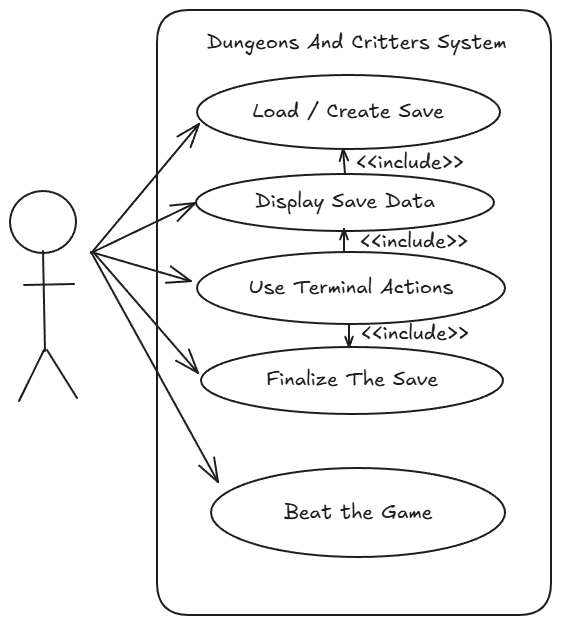
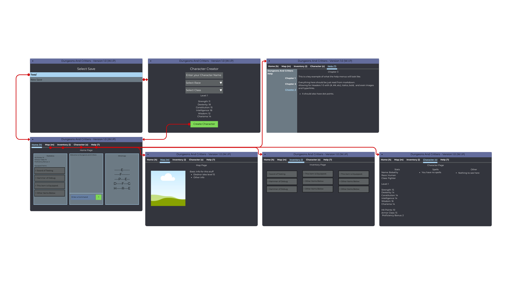
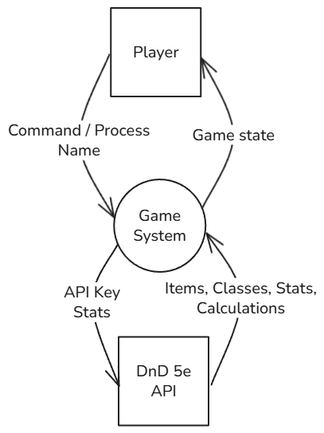
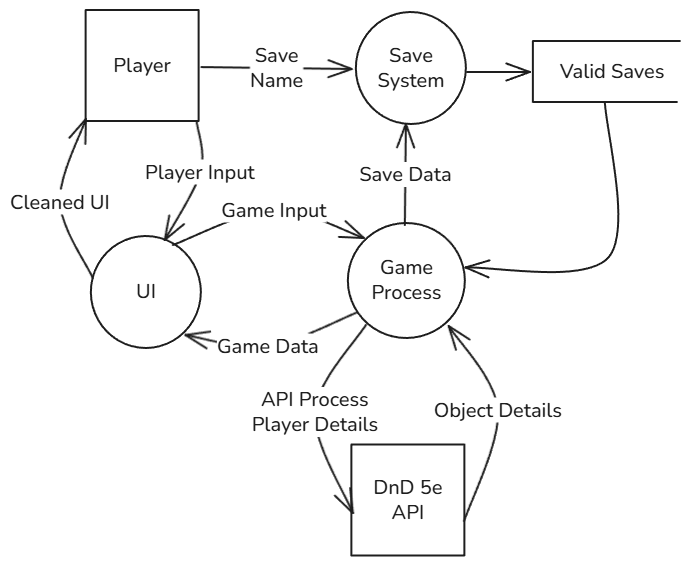
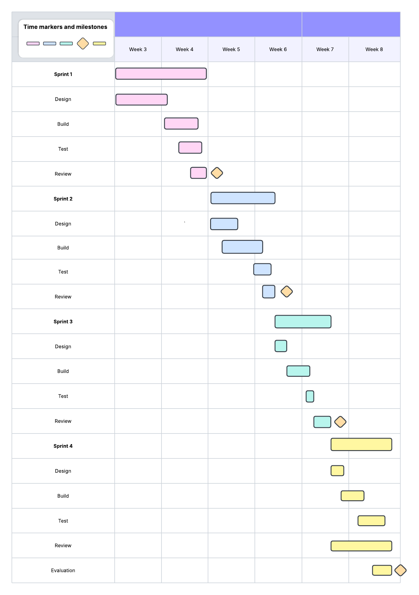

# Jamie Hanson - Software Engineering - Task 2 2025 - Due 20/5/2025
### By Jamie Hanson

# Sprint 1
## Requirements Definition
### Functional Requirements
* A user interface featuring easy to read menus that display information for the user.
* An inventory system allowing the user to see their items
* A map system allowing the user to see the world
* A Character Creator allowing the system to make their own character with its own stats (Functional DnD stats)
* Inputs that allow for text to be typed, inputs to be received from keyboard presses outside of text boxes, and mouse clicks.
* An easy to read heads up display (HUD) or UI displaying the players health and basic stats.
* A terminal like menu for the text-based portion of the game.
* Display errors to the user to allow for user-based errors to be fixed in runtime.
### Non-Functional Requirements
* The system needs to be quick, launching within 3 seconds.
* The system needs to reliably handle crashes, giving the user enough information to report it or fix it themselves.
* The system needs to reliably handle user errors, producing useable data from any scenario or alternatively denying the submission of the data until the format is correct.
* The system needs to be easy to navigate via the Keyboard and Mouse, (Mainly the keyboard)
* The system should have a tab or seperate menu for help, which will provide documentation on the core functionallity of the system and where to get more help about each part of the system.
* The system needs to reliably get and convert save data aswell as user inputs. Save corruption and errors in loading should be a worst case scenario and happen few and far between, if at all.

## Determining Specifications
### Functional Specifications
* The user needs to be able to easily access multiple saves for different characters that are clearly labelled and independant.
* The user needs to be able to easily navigate between the main UI's.
* The user needs to be able to quickly and easily control there characters inventory and stats.
* The user needs to be able to easily access a help page that will explain the systems more complex implementations
* The system needs to accept UI related inputs like tab switching through the keyboard and mouse aswell as text based inputs that cut off control the the UI while entered.
* Text inputs should accept all basic unicode characters.
* The system needs to output the players location, health, stats, and other basic details
* The system needs to output the players actions and details within the "Terminal" within the program.
* The program needs to be able to access online databases (DnD 5e's API) to get stats for monsters and items etc...
* The user will interact with the system through A TUI (Terminal User Interface) mixed with its own actual CLI (Command Line Interface) within the TUI. The CLI within the TUI will be used for player actions.
* Any invalid inputs need to be either rejected, or clearly output incorrect answers that allows the user to correct their mistake with minimal reprecussions.
* The system needs to be able to provide a basic crash log in the form of a .log file within the logs folder. 

### Non-Functional Specifications
* The system should be lightning fast, running everything visually within seconds and the content taking a little bit longer than that.
* Basic actions should have response times in less than a second. With bigger actions allowing for longer wait times.
* The program will need to remain efficient through efficient use of hard coding details and caching.
* The TUI will use mainly high contrasting colours avoiding white text on white backgrounds etc...
* The TUI should be nearly completely navigatable through just the keyboard using TAB and over varients.
* Data corruption needs to be minimal and not occur throughout any stage of testing (Unless tests are run mid-sprint not post-sprint, then data corruption can be ignored).
* Invalid data from online sources like the DnD database could cause a lack of reliability, so the program should minimise the effect of invalid data through a placeholder method (I.E. If a mob that doesn't exist is called, it could replace it with a basic humanoid zombie or something similar)

### Use Case
**Actor:** User (Professional or Amateur Gamer)

**Preconditions:** Internet access; API with DnD data is available. Python installed.

**Main Flow:**
 1. Load / Create a save.
 2. Display Save Data -- Character Stats, Inventory, Location, etc... --; System confirms data and displays it to the user.
 3. Use Terminal Actions -- Move the player, Equip Items, Attack, Etc... --; The system displays the actions informational text and updates the stats and save.
 5. Finalise Save; The system adds content to the save. 
 4. Beat the game, -- User completes the win condition of the game --; The system keeps or deletes the save, and marks the game as complete. Removing most of the playable content.
 

**Postconditions:** Save data is retrieved and stored successfully.

## Design
### Story Board

### Data Flow Diagram - Level 0 (Context) and Level 1
**Level 0** \

**Level 1** \

### Gantt Chart

## Build and Test

## Review

# Sprint 2